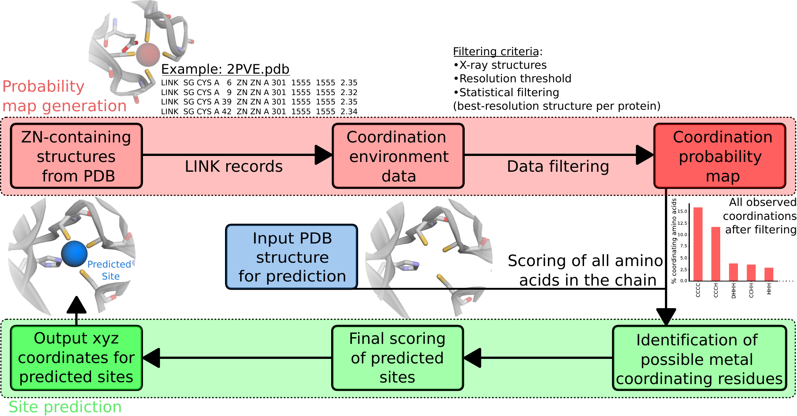
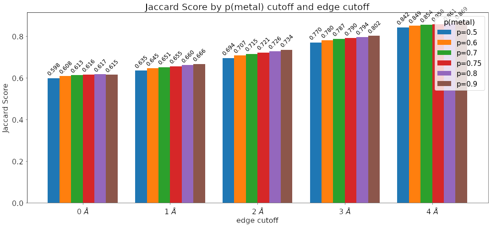
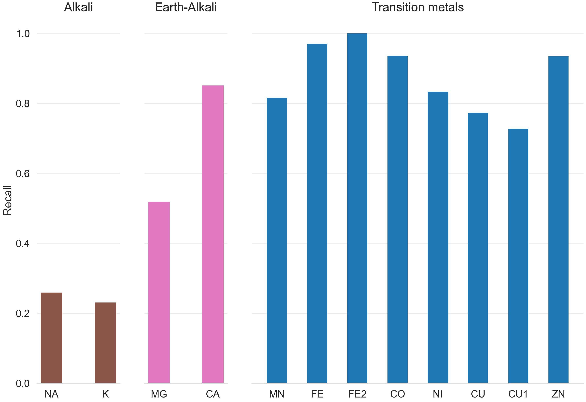
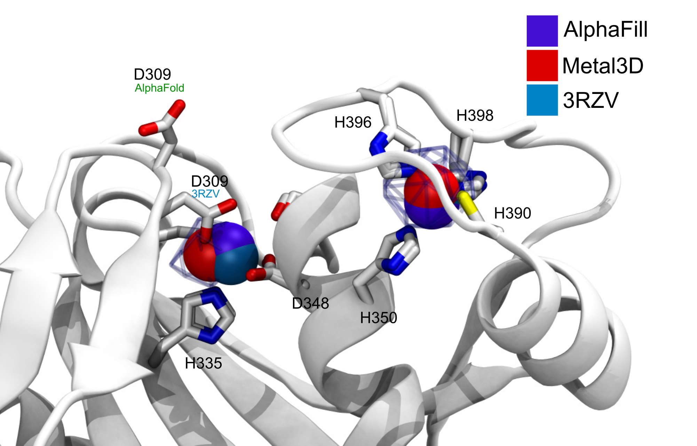
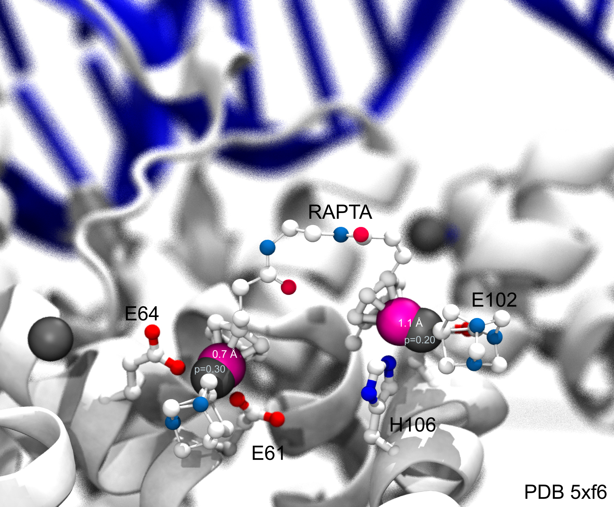
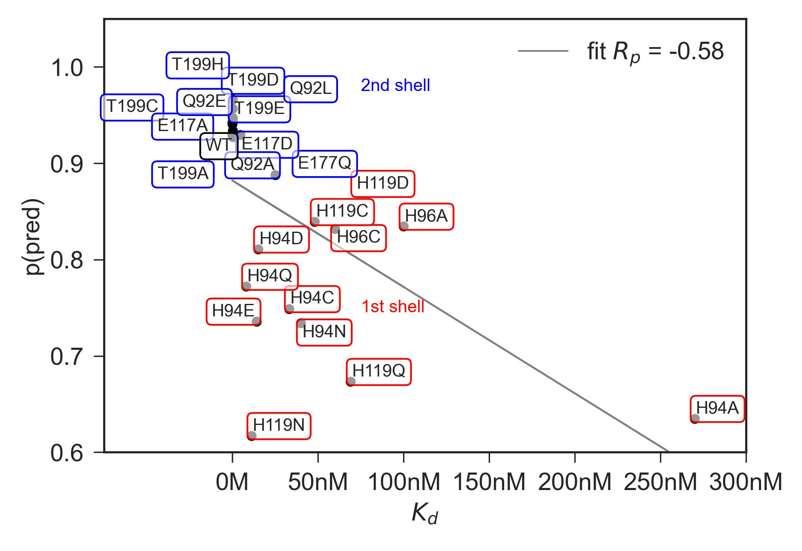
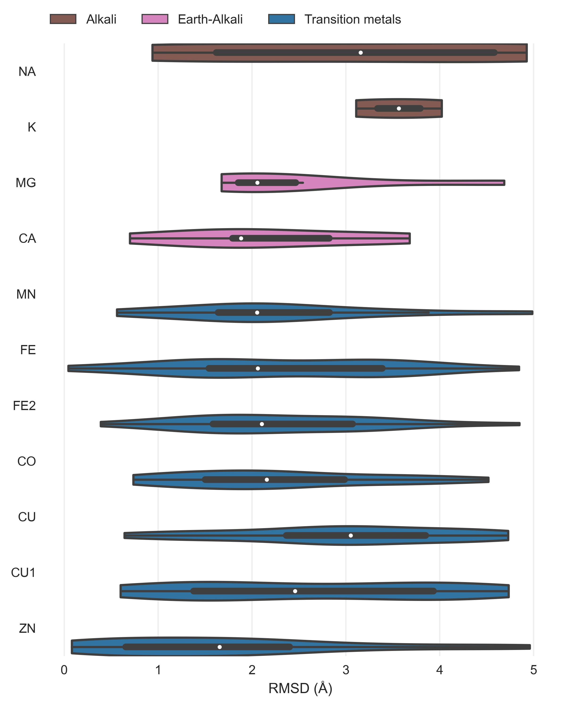
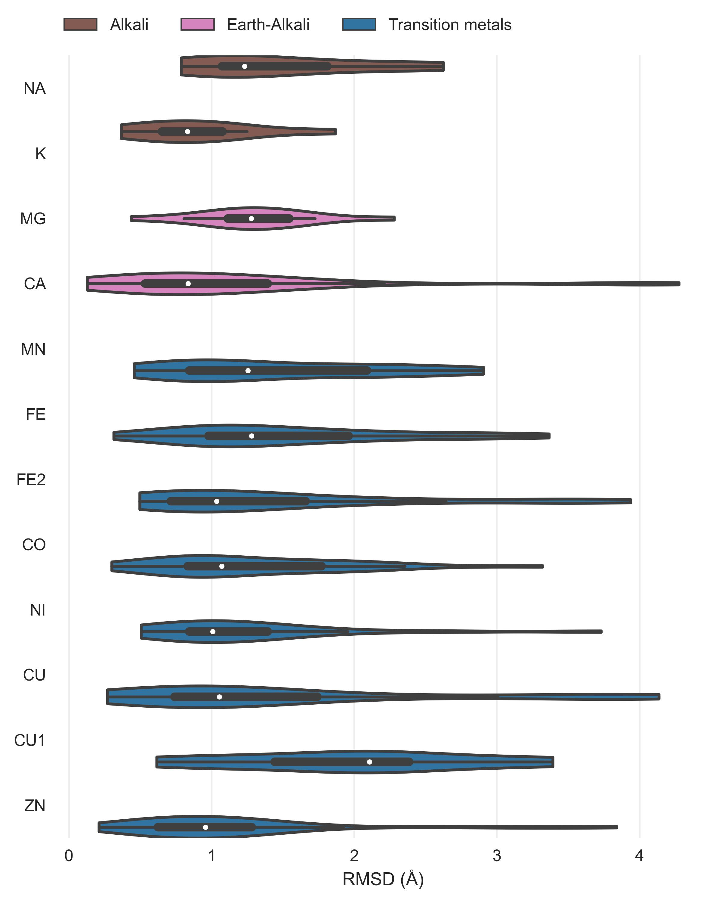

---
title: Accurate prediction of metalsites using deep learning
keywords:
- metal
- protein engineering
- deep learning
lang: en-US
date-meta: '2022-02-23'
author-meta:
- Simon L. Dürr
- Andrea Levy
- Ursula Rothlisberger
header-includes: |-
  <!--
  Manubot generated metadata rendered from header-includes-template.html.
  Suggest improvements at https://github.com/manubot/manubot/blob/main/manubot/process/header-includes-template.html
  -->
  <meta name="dc.format" content="text/html" />
  <meta name="dc.title" content="Accurate prediction of metalsites using deep learning" />
  <meta name="citation_title" content="Accurate prediction of metalsites using deep learning" />
  <meta property="og:title" content="Accurate prediction of metalsites using deep learning" />
  <meta property="twitter:title" content="Accurate prediction of metalsites using deep learning" />
  <meta name="dc.date" content="2022-02-23" />
  <meta name="citation_publication_date" content="2022-02-23" />
  <meta name="dc.language" content="en-US" />
  <meta name="citation_language" content="en-US" />
  <meta name="dc.relation.ispartof" content="Manubot" />
  <meta name="dc.publisher" content="Manubot" />
  <meta name="citation_journal_title" content="Manubot" />
  <meta name="citation_technical_report_institution" content="Manubot" />
  <meta name="citation_author" content="Simon L. Dürr" />
  <meta name="citation_author_institution" content="Laboratory of Computational Chemistry and Biochemistry, Institute of Chemical Sciences and Engineering, Swiss Federal Institute of Technology (EPFL) CH-1015 Lausanne, Switzerland" />
  <meta name="citation_author_orcid" content="0000-0002-4304-8106" />
  <meta name="twitter:creator" content="@simonduerr" />
  <meta name="citation_author" content="Andrea Levy" />
  <meta name="citation_author_institution" content="Laboratory of Computational Chemistry and Biochemistry, Institute of Chemical Sciences and Engineering, Swiss Federal Institute of Technology (EPFL) CH-1015 Lausanne, Switzerland" />
  <meta name="citation_author_orcid" content="0000-0003-1255-859X" />
  <meta name="citation_author" content="Ursula Rothlisberger" />
  <meta name="citation_author_institution" content="Laboratory of Computational Chemistry and Biochemistry, Institute of Chemical Sciences and Engineering, Swiss Federal Institute of Technology (EPFL) CH-1015 Lausanne, Switzerland" />
  <meta name="citation_author_orcid" content="0000-0002-1704-8591" />
  <meta property="og:type" content="article" />
  <meta property="twitter:card" content="summary_large_image" />
  <link rel="icon" type="image/png" sizes="192x192" href="https://manubot.org/favicon-192x192.png" />
  <link rel="mask-icon" href="https://manubot.org/safari-pinned-tab.svg" color="#ad1457" />
  <meta name="theme-color" content="#ad1457" />
  <!-- end Manubot generated metadata -->
bibliography: []
manubot-output-bibliography: output/references.json
manubot-output-citekeys: output/citations.tsv
manubot-requests-cache-path: ci/cache/requests-cache
manubot-clear-requests-cache: false
...

<!-- 
<small><em>
This manuscript
was automatically generated
on February 23, 2022.
</em></small> -->

## Authors

<!--  -->
<!-- 
+ **Simon L. Dürr**   
    {.inline_icon}
    [0000-0002-4304-8106](https://orcid.org/0000-0002-4304-8106)
    · {.inline_icon}
    [simonduerr](https://twitter.com/simonduerr) 
  <small>
     Laboratory of Computational Chemistry and Biochemistry, Institute of Chemical Sciences and Engineering, Swiss Federal Institute of Technology (EPFL) CH-1015 Lausanne, Switzerland
  </small>

+ **Andrea Levy**   
    {.inline_icon}
    [0000-0003-1255-859X](https://orcid.org/0000-0003-1255-859X) 
  <small>
     Laboratory of Computational Chemistry and Biochemistry, Institute of Chemical Sciences and Engineering, Swiss Federal Institute of Technology (EPFL) CH-1015 Lausanne, Switzerland
  </small>

+ **Ursula Rothlisberger** †  
    {.inline_icon}
    [0000-0002-1704-8591](https://orcid.org/0000-0002-1704-8591) 
  <small>
     Laboratory of Computational Chemistry and Biochemistry, Institute of Chemical Sciences and Engineering, Swiss Federal Institute of Technology (EPFL) CH-1015 Lausanne, Switzerland
  </small>
 -->

[{height="11px" width="11px"}](https://orcid.org/0000-0002-4304-8106)
Simon L. Dürr 1,
[{height="11px" width="11px"}](https://orcid.org/0000-0003-1255-859X)
Andrea Levy 1,
[{height="11px" width="11px"}](https://orcid.org/0000-0002-1704-8591)
Ursula Rothlisberger 1,†

<!--☯ --- These authors contributed equally.   -->
† --- To whom correspondence should be addressed: ursula.roethlisberger@epfl.ch
<small>

###### Affiliations

1. Laboratory of Computational Chemistry and Biochemistry, Institute of Chemical Sciences and Engineering, Swiss Federal Institute of Technology (EPFL) CH-1015 Lausanne, Switzerland

### Abstract

## Introduction

Metalloproteins protein many biological functions [Percora review]? 
As oneof the most prevalent transition metal cofactors in
biological systems, it plays structural, signaling, and regulatory
roles and is found in all six classes of enzymes (most commonly
hydrolases

Understanding where metals bind in biology is related to health [@doi:10.1038/s42256-019-0119-z], biocatalyis [Kuhlman, Hilvert] and PPIs [Tezcan]. 

Starting with pioneering studies in the 1990 s,[@doi:10.1126/science.8346440;@doi:10.1146/annurev.biochem.68.1.779]there have been notable successes inthe de novo design of functional metalloproteins, which arepredominantly based on four-helix bundle anda-helicalcoiled-coiled motifs with readily parametrizable structure [@doi:10.1002/anie.202009226]. 

Zinc exists as a redox-inert Zn(II) cation with an electron configuration of [Ar]3d10
These properties with the lack of ligand field effects make zinc an excellent metal for different coordination numbers and binding geometries in different biological systems.
 Zinc can be found as an active site metal (cofactor) in all six IUBMB enzyme classes
### Deep learning on proteins
Torng/Shroff 3DCNN bio stuff 
Ananad DeepRank
Correia surface studies Nat Methods 

### Enzymes

### Interfaces
It has been hypothesized that some modern metalloproteins may have emerged through the metal-nucleated oligomerization of small peptides or protein domains, followed by the evolution of the resulting assemblies into stable, functional architecture.

Metal-Templated Interface Redesign (MeTIR) ). These strategies, inspired by both the proposed evolutionary roles of metals and their prevalence in natural PPIs, take advantage of the favorable properties of metal coordination (bonding strength, directionality, and reversibility) to guide protein self-assembly with minimal design and engineering

In order to circumvent the complexity of constructing extensive noncovalent interfaces, which are typically involved in natural PPIs

### Existing approaches

Computational predictors of metal-binding sites built on sequence analyses are mostly based on scanning the sequence of a target protein to identify those regions where amino acid patterns match a metal-binding site fingerprint. For zinc binding sites often two histidine spaced by one residue which allows to readily detect the motif are easy to detect. These predictors yield the identites of the coordinating residues. 

Structural detectors often used distance features to identify sites based on statistical mining in the protein databank.  Predictors trained like this can identify highly preorganized motifs (e.g 4x Cys in close spatial proximity) but are often not very good at identifying weakly preorganized motifs. Current state of the art predictors (MIB, BioMetAll) use fragments/homology to predict the location of the metal or backbone preorganization predicting an approximate position of the metal that is less sensitive to the exact side chain geometry thus affording higher sensitivity to detect metal sites(BioMetAll). MIB [@doi:10.1021/acs.jcim.6b00407] uses the fragmentation transformation method to search for homologus sites in its database

In our work we develop two new predictors primarily intended for zinc binding sites - Metal1D and Metal3D that are more accurate and sensitive than existing approaches in predicting metal ion binding sites. We evaluate their capability with respect to 

## Materials and Methods

### Dataset
Zinc The average bond length corresponds to a resolution of ∼2.2 Å. Also, the deviation increases noticeably after the resolution exceeds 2.5 Å. [@doi:10.1021/ic401072d]

The input PDB files for training were obtained from the RCSB protein databank (Download 5. March 2021). We used a clustering at 30% sequence identity using MMSeqs2 as the input to largely remove sequence and structural redunancy in the input dataset. 
For each cluster we check whether a zinc is contained in one of the structures, whether the resolution of these structures is better than 2.5 A, the experimental method is X-Ray crystallography and whether the structure does not contain nucleic acids. If there are multiple structures fulfilling the criteria the highest resolution structure is used. Structures that fulfill all criteria except the zinc criterion are kept to for selectivity analysis for different metals. 
All structures larger than 3000 residues are discarded. 
The train/val/test split was performed based on sequence identity using `easy-search` in mmseqs. All proteins that had no (partial) sequence overlap with any other protein in the dataset were put into the test/val set (85 proteins) which we further split into a test set of 59 structures and 36 structures in the validation set. The test set contained 1614 structures. (Reported as csv Supplemental Data 1).

### Metal 1D

{#fig:metal1dworkflow}

The statistical analysis performed is focuses on the `LINK` records present in deposited PDB structures. In particular, this section of a PDB file specifies the connectivity between zinc (or any other metal ion) and the amino acids of the protein, and each `LINK` record specifies one `LINK`age. After having extracted the `LINK` records, data were filtered, only considering X-ray structures with resolution better than 2.5 Å. Aiming to obtain a statistically significant sample, for proteins which present more than one deposited structure, only the best-resolution one was used. This selection is based on the MOLECULE record of the deposited structures.
After the statistical filtering, a probability map is generated from the `LINK` records, extracting for each zinc ion the coordination experimentally observed. In this phase, `LINK` records involving only a single amino acid are excluded since they probably correspond to weak binding sites. In this phase, also `LINK` records containing water molecules are excluded. This is done for two reasons: in the first place, because it would be needed to restrict only to higher-resolution structure to have a reliable probability map including waters, which would drastically reduce the pool of structures used. Moreover, in the predicting phase, it would be needed to have protein structures with waters, which is not the general case due to experimental limitations and to difficulties to place water molecules a posteriori. Even if many tools are available, they are not able to handle the presence of metal ions. Due to these limitations, water molecules are considered only implicitly in this method.

The probability map is used to predict the metal sites for a given protein structure. To make a prediction, each amino acid of the protein is scored. The score is assigned performing a geometrical serch from a reference point, defined as the coordinate of the most probable metal binding atom, within a search radius, considered as twice the typical distance between the metal ion and the binding atom of amino acids in proteins. This quantity is enlarged of an arbitrary factor, in order to be able to take into account deviations from the ideal cooridnation and give more flexibility to the search. In case of amino acids which present more than one atom which typically binds metals, such as Histidine, the mid-point is used and the search radius is enlarged accordingly. 
The score is assigned to each amino acid considering all the other reference points of other amino acids within the search radius, and summing the probabilities in the probability map for coordinations compatible with the one observed. In the ideal case, a score of $1$ would correspond to an amino acid surrounded by all possible coordinating amino acids observed in the probability map. In practice, scores result between $0$ and less than $1$.

Once all amino acids in the chain are scored, site predictions are made grouping the highest-scored amino acids in clusters, based on distance. In practice, highest-scored amino acids are the ones with a score within a given threshold of the highest-scored one. For each cluster, a site prediction is made as a weighted average between the coordinates of the reference point of each amino acid, using as weighting factor the amino acid score. In the case of clusters composed of only one amino acid, to be able anyway to perform a site prediction, a fictitious score equal to the single highest-scored amino acid in the cluster is assigned to the nearby amino acid  (within the search radius) with the highest score. It is important to note that this amino acid was not in the highest-scored ones used to make the clusters, but in this way also for clusters with only one amino acid, a prediciton is made. The potential artefacts introduced by assigning a fictitious score to another amino acid is resolved by a final re-scoring of all the predicted sites.
This final re-scoring also mitigates the errors which can be introduced by calculating the site simply as a weighted average. In particular, a final geometrical search is performed around each predicted site (within 0.6 Å  the search radius, which as explained is about twice the typical metal-amino acid distance) and a score is now assigned to the site. This score is assigned in the same way as the amino acid scores, based on the probability map, and has the advantage of being able to sort the predicted metal sites based on their probability, according to the method. In this last re-scoring, sites with a probability lower than a certain threshold with respect to the highest-scored one, are excluded, in order to focus only on predictions with the highest probability. 

### Metal 3D

#### Voxelization
We used the moleculekit python library [@doi:10.1021/acs.jctc.6b00049; @doi:10.1093/bioinformatics/bty583]  to voxelize the input structures into 3D grids. 8 different input channels are used aromatic, hydrophobic, positive ionizable, negative ionizable, hbond donor, hbond acceptor, occupancy and metal ion binding site chain were used. For the target box only zinc ions were used. The target tensor was discretized setting any voxel above 0.05 to 1 (true location of zinc), all other to 0 (no zinc).  We used a box size of 20 Å centered on the CA residue of a residue, rotating each box randomly. The voxel grid used a 1 Å resolution. 
For all structures selected for the respective sets we partionied the residues of the protein into residues within 12 Å of a zinc ion and ones not within 12 Å of a zinc. To make a balanced set of examples we voxelize all residues that are close to a zinc and an equal amount of residues randomly drawn from the non-zinc binding residues. 
The environments are precomputed and stored in HDF5 files for concurrent access during training. In total 266283 environements were computed for the training set, XXX for the test set, XXX for the validation set. 

#### Model training
We used PyTorch 1.10 to train the model. All layers of the network are convolutional layers with filter size 3 Å except for the second layer where 4 Å size is used and the fifth layer where a 16 Å filter is used to capture long range interactions. We use zero padding to keep the size of the boxes constant. Models were trained on a workstation with 2x NVIDIA GTX2070 GPU and 28 CPU cores. 
Binary Cross Entropy [@doi:10.1007/s10479-005-5724-z] loss is used to train the model. The rectified linear unit (ReLU) non-linearity  is used except for the last layer which uses a sigmoid function which yields the probability for zinc per voxel.
A dropout layer (p = 0.2) was used between the 5th and 6th layer. 
The network was trained using AdaDelta, a stepped learning rate (lr=1.0, ɣ=0.7) a batch size of 500 and 12 epochs to train.

#### Hyperparameter tuning
Ray Tune following parameters were tuned with 15 different combinations:

- filtersize: 3,4
- dropout : 0.1, 0.2, 0.4, 0.5
- learning rate : 0.5, 1.0, 2.0
- gamma: 0.5, 0.7, 0.8, 0.9
- batch size: 128, 200, 500

#### HCA2 mutants 

Richardson Rotamer library 
EVOLVE-ddG
implicit solvent, double deprotonated histidines for rotamer optimization 
Zinc cationic dummy model 

## Results

### Metal1D

<!---
The starting PDB structures used are the ones in the training set, discuss what's the best way to describe it: repeat what is also said later for Metal3D?  
-->

The statistical analysis performed is focuses on the `LINK` records present in deposited PDB structures. LINK data were filtered to obtain a statistically significant sample, restricting only to X-ray structures with resolution better than 2.5 Å, and considering only the best-resolution structure for proteins presenting more than one deposited structure. This filtered sample is used to extract a probability map for the coordinating amino acids, which is used to predict metal sites: for a given protein structure, each amino acid of the protein is scored based on the probability map, performing a geometrical serch around the amino acid. For Zn(II), the average `LINK` length resulted 2.2 ± 0.2 Å, and the default search radius was then set to 5.5 Å. 

Once all amino acids in the chain are scored, site predictions are made grouping the highest-scored amino acids in clusters, based on distance. For each cluster, a site prediction is made as a weighted average between the coordinates of the reference point of each amino acid, using as weighting factor the amino acid score. A final re-scoring is performed, now assigning a score to the predicted locations for the sites, based on surrounding amino acids, in order to sort the predictions based on the probability, according to the method. This final re-scoring process also mitigates the possible artefacts originated by the prediction phase, excluding sites  which are placed in positions with a low-probable coordinating  environment. 

<!---
Not sure if this  two paragraphs are too long for the results section, I tried to highlight how the method works without focusing on the details (explained in the method section), but may need to make it shorter
-->

### Metal3D

The model was trained using a train/test/val split based on sequence identity. We used the MMSeqs2 clustered PDB at 30% sequence identity and used the highest resolution structure from each cluster that contained a zinc, did not contain DNA and had resolution < 2.5 Å. In case no structure was found the cluster was discarded. 

The training examples were sampled from the chosen structure by choosing a balanced number of boxes from each protein that contained or did not contain a zinc. Each box was randomly rotated such that the model is insensitive to rotation. 

Metal3D predicts a per residue score that can then be averaged over all residues or used individually (e.g for protein design). 

Hyperparameter tuning using Ray tune

Evaluation of quality of predictions per box using discretized Jaccard Score (similarity of two sets). We noticed that at the edges often spurious density is predicted . 

{#fig:jaccard}

#### Selectivity for other metals

{#fig:selectivity-metal3d}

Trained exclusively on zinc, Metal3D works well to predict the location of transition metals from 25 randomly drawn structures for each metal. 
[@fig:selectivity-metal3d] shows that recall is high for all transition metals meaning the Metal3D model correctly finds most sites in the test sets. For the alkali and earth alkali metals recall is much lower as the model only finds some sites. 
The mean probability for found zinc structures (ZN p= ±) in the test set is higher than for the other transition metals [@fig:selectivity-probability-metal3d] and significantly higher than for the alkali metals (NA p=XX±, K p=XX±). The probability for MG (p=XX ±) is lower than for CA (p=XX±). The RMSD for each found metal site is again lowest for zinc. The mean RMSD for sodium and potassium are as low as for the other transition metals. The only metal with significantly higher RMSD (2.X ±) is copper(I). 

For Metal1D overall recall is lower with similiar differences in the detection of main group metals versus transition metals [@fig:selectivity-metal1d; @fig:selectivity-distance-metal1d]

#### Alpha Fold 

AlphaFold often predicts sidechains in metal ion binding sites in the holo conformation. Services like AlphaFill use homology to transplant metals from similar PDB structures to the AlphaFold structure. Metal3D does not use homology can even deal with metal sites that are only partially in the holo conformation. 

{#fig:alphafold}

#### Hidden/transient metalsites

Metallodrugs are in important class of drugs that rely on binding inhibitors to a protein (or DNA). Metal3D can be used to screen the hidden metalloproteome by finding transient metal ion binding sites. 

The site where Rapta binds is detected with p=0.3 but in a high resolution structure without (1KX4) there is a salt bridge with a lysine that might occlude metal detection. One could weight by the rotamer/do MD simulation e.g similar as for cryptic pockets. 

{#fig:drugdesign}

#### HCA2: case study

HCA2 is the first enzyme where a catalytic zinc was discovered and is therefore one of the best studied metalloenzymes to date with a rich throve of mutational data available. 
On the wildtype enzyme crystal structure (2CBA) Metal3D perfectly recapitulates the location of the active site metal when using a high probability cutoff (p>0.4). The sites predicted with lower probability all look like reasonable transient binding sites at the surface of the protein. 

{#fig:2cba-probabilites}

We used in silico generated mutants matching mutants in the first and second shell of the active site zinc and probed the effect on the predicted metal probability. For mutants that decrease zinc binding also a drop in probability can be observed that correlates well with the experimentally measured $K_d$. We used a consistent set of $K_d$ values from the literature.

{#fig:hca-kd}

### Comparison of Metal1D, Metal3D, MIB and BioMetAll

Many metal ion predictors exists that can be subdivided in two categories: binding site predictors and binding location predictors. The former label only the residues binding the ion, the latter also predict a location of the ion. 

In addition to Metal1D and Metal3D we also compared two recent predictors BioMetAll and MIB. MIB uses a fragment method to identify homologus binding sites to the motifs it finds in a given structure and will extract the location of the metal from the homologous structures in its database. The main performance regulator of MIB is the tscore cutoff which is a parameter for the template similiarity with higher values requiring higher similiarity. 
BioMetAll was calibrated on the PDB and places probes on a regular grid at all sites where they find the criteria to be fulfilled. For each collection of probes also a center of the probes is given which we used to assess performance as there is no individual ranking of the probes given by the program. The main parameter for BioMetAll is the cluster cutoff which indicates how many probes in reference to the largest cluster a specific cluster has. We used a cutoff of 0.5 requiring all chosen clusters to have at least 50% of the probes of the most popolous. 

For both tools the recommended settings match the accuracy of Metal3D p=0.75 with a lot more false positives. 
Metal1D offers high detection capabilites but also with a high number of false positives.
While MIB also offers high precision, BioMetAll (using the cluster center) is not very precise with a MAD for correctly identified sites of 2.8 +- XX. Metal1D which identifies more sites than BioMetAll is slightly more precise than BioMetAll. MIB detects less sites but does so with high precision because it can use homologues sites to correctly place the metal ligand. BioMetAll also often provides probes that correctly identify the metal but as there is no ranking of the probes any probe could be closest to the actual location. 

{#fig:comparison}

{#fig:distances-testset-Metal3D}

## Discussion

3D CNN model accuracy. Recent work EquiDock uses no sidechains at all, gets ligand RMSD where only 25% are under a 2 threshold, https://arxiv.org/pdf/2202.05146.pdf Mean RMSD 8.3 A, Centroid 42.4

MIB discards all sites with less than 2 coordination partners so it will not be able to identify labile binding sites. 

Discuss 4L99 which is one of the FN for the model. Here are Lysine next to the zinc and therefore probability is low.Could be wrongly modeled (carboxlyated lysine instead of normal lysine) [@doi:10.1016/S0022-2836(02)00422-9] but some leucyl aminopeptidases also have this coordination. (check 10.1515/BC.2006.191 to find mechanism)

discuss why water molecules were not considered. considered only implicitly. Might be integrated in future but needs quality check for existing waters in training/test set 
Methods [References Dowser] that place deep waters but they do not know about metals. 

Lack in selectivity could be related to smoothing the gaussian quite a bit when training (anything >0.05) is a hit. 
Resolution of grid might be an issue 
Might be improved by improving the grid resolution to 0.5  

Discuss selectivity. E.g based on [@doi:10.1073/pnas.0906852107]. Zinc prefers tetrahedral coordination, whereas e.g copper(II) (and maybe CU(I)- check it) prefers square planar which might explain a bit lower selctivity. In the work by Tezcan the protein assemblies form different complexes with the different metals. 

General implications for the faint metal ion binding sites detected using the model: This is evident from the fact that unstructured polypeptides and folded proteins alike often form aggregates in the presence of high concentrations of transition metals.
Once the entropic cost of association is overcome, the resulting noncovalent interfaces can be optimized through additional mutations
 These nonspecific interactions could explain why free zinc concentration is tightly controlled in cellular environments; the total concentration of zinc in cells is about 200 μM, but the concentration of free zinc is only picomolar[@doi:10.1021/cr800556u].

From a practical inorganic chemical viewpoint individual proteins can be utilized as large polydentate ligands that bring along the advantage of having extensive functionalizable surfaces. From a functional perspective metals possess properties such as Lewis acidity and redox reactivity that enable them to carry out catalytic transformations not accessible by organic building blocks.

Our tool allows to move away from using rational approaches such as the  i, i + 4 diHis motifs used for the assembly and stabilization of metalloproteins and peptides through coordination of divalent transition metal ions to a more knowledgebased approach. [@doi:10.1126/science.8346440; @doi:10.1126/science.1648261; @doi:10.1038/nsb723]

Moreover, one-third of the zinc ions present in crystal structures are artifacts, merely aiding crystal formation and packing with no biological significance [@doi:10.1021/ic401072d]

 The small size of the Zn(II) cation (∼74 pm for four-coordinate and ∼88 pm for six-coordinate ion) prevents higher coordination numbers due to molecular repulsion and higher energy orbitals

 <!-- KD values discussion (new ITC data vs. old data by Kiefer, Fierke etc): 
 
 Old method: Enzyme-
bound zinc (E—Zn) was quantitated using the colorimetric
4-(2-pyridylazo)resorcinol (PAR) method of Hunt et al.
(1984) and measuring the absorbance at 500 nm. 4-(2-Pyridylazo)resorcinol (PAR) is a dibasic acid that forms the protonated complexes with most metal ions. It serves as a metallochromic indicator and is suitable as a chromogenic agent for the quantitative determination of over 50 elements.

removing unbound zinc by chromatography on a
PD-10 column, and measuring the protein concentration and
bound zinc concentration in the eluant using the PAR assay
(Hunt et al., 1984).
The concentration of free zinc in the
dialysis buffer was calculated from the Tris—zinc stability
constants (Dawson et al., 1986). The dissociation constant
was calculated using KaleidaGraph program with eq:
[E-ZN]/[E]tot = C/(1+Kd/[Zn]free)

[@doi:10.1021/ic301645j]
 -->

## Conclusion

## Supplement

### Metal site detection using Metal1D

Maybe ROC curve for Metal1D and Metal3D here

### Metal selectivity 

#### Metal1D

{#fig:selectivity-metal3d}

{#fig:selectivity-distance-metal1d}

#### Metal3D

{#fig:selectivity-distance-metal3d}

{#fig:selectivity-probability-metal3d}

### Comparison 

{#fig:madonlyGoodZnmetal3d}

{#fig:tpfpfnonlyGoodZn}

## References {.page_break_before}

<!-- Explicitly insert bibliography here -->

