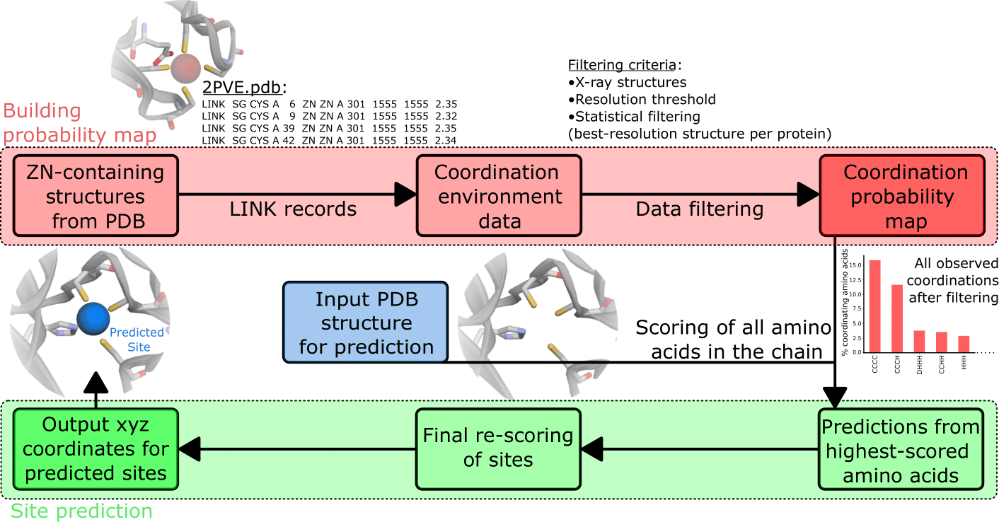

## Materials and Methods

### Dataset
The input PDB files for training were obtained from the RCSB [@doi:10.1093/nar/28.1.235] protein databank (downloaded 5th March 2021). We used a clustering of the structures at 30% sequence identity using mmseqs2 [@doi:10.1038/nbt.3988] as the input to largely remove sequence and structural redundancy in the input dataset. 
For each cluster we check whether a zinc is contained in one of the structures, whether the resolution of these structures is better than 2.5 Å, if the experimental method is x-ray crystallography and whether the structure does not contain nucleic acids. If there are multiple structures fulfilling these criteria the highest resolution structure is used. 
All structures larger than 3000 residues are discarded. We always use the first biological assembly to sample the training environments as metals are often located at protein interfaces. All structures are filtered to only contain zinc and protein residues. If there are multiple models in the structure the first one is used. For each biological assembly we used the symmetry of the assymetric unit to generate a protein structure that contains all neighboring copys of the protein in the crystal such that metal sites at crystal contacts are fully coordinated. 

The train/val/test split was performed based on sequence identity using `easy-search` in mmseqs2. All proteins that had no (partial) sequence overlap with any other protein in the dataset were put into the test/val set (85 proteins) which we further split into a test set of 55 structures and 25 structures in the validation set. The training set contained 2085 structures. (Reported as CSV Supplemental Data 1).

In the analysis we always used the biological assembly and not the symmetry augmented structure. For the selectivity analysis, the clusters from the PDB were randomly sampled to extract about 25 structures per metal (Supplemental Data 2) and all metal sites that had at minimum 3 unique protein ligands within 2.8 Å of the metal were used for the analysis to exclude any crystallization artefacts for the selectivity analysis. For the zinc analysis we used either all zinc ions contained in the structures or all that had at minimum 2 unique protein ligands within 2.8 Å of the metal. This removes most sites that are crystal contacts.  

### Metal 1D

<!-- I rewrote this section a bit too shorten it and remove wordy passive voice constructions and fill words such as In particular, anyway etc-->

{#fig:metal1dworkflow}
Metal1D uses a probability map derived from  `LINK` records in protein structures. The `LINK` section of a PDB file specifies the connectivity between zinc (or any other metal ion) and the amino acids of the protein, and each `LINK` record specifies one linkage. The idea of basing this approach on the `LINK`s is an extension to the approach by Barber-Zucker *et al.* [@doi:10.1038/s41598-017-16777-5], where they used the `LINK` records to investigate the propensity of transition metals to bind different amino acids, but not for the coordination.

Using the training set we generated a probability map for the propensity of different coordination environments to bing a zinc (e.g CCCC, CCHH etc.). For each zinc ion the coordination is extracted from `LINK` excluding records involving only single amino acids (weak binding sites). Also, `LINK` records containing water molecules are excluded because of the difficulties in placing water molecules a posteriori in 3D structures when metal ions are present. The probability map contains the counts of coordination environments found.  <!-- this is results/discussion and does not belong here
<!-- Anyway, in the case of structures where water molecules were placed with high confidence, experimentally or a posteriori, it would be sufficient to change the `IncludeWATER` flag to consider water molecules as all the other residues in the prediction phase. However, this would still rely on a probability map built from the structures in the PDB,  where the location of water molecules is not very consistent. This problem could be overcome in the future, thanks to the increasing number of high-resolution structures available.  -->  
To make a prediction, each amino acid of a protein is scored (Fig. [@fig:metal1dworkflow]). 
The procedure has two steps: Identification of possible metal coordinating residues in the structure and scoring of the likelihood of the coordination after a metal has been placed between the identified coordinating residues. 

The 3D protein structure is analyzed using the BioPandas python library [@doi:10.21105/joss.00279]. To identify coordinating residues a per residue score is assigned performing a geometrical search from a reference point, defined as the coordinate of the most probable metal binding atom, within a search radius, considered as twice the typical distance between the metal ion and the binding atom of amino acids in proteins (2.2 ± 0.2 Å). <!-- List the atom names that were used in a table in SI or refer to the file where they can be found in the repo --> The search radius used was 5.5 Å in order to be able to take into account deviations from the ideal coordination. In the case of amino acids which present more than one atom which typically binds metals, such as histidine, the mid-point is used and the search radius is enlarged accordingly <!-- by how much. A man needs a number -->. 
The score is assigned to each amino acid considering all the other reference points of other amino acids within the search radius, and summing the probabilities in the probability map for coordinations compatible with the one observed. In the ideal case, a score of 1 corresponds to an amino acid surrounded by all possible coordinating amino acids observed in the probability map. In practice, scores result between 0 and less than 1.
Once all amino acids in the chain are scored,the metal location predictions are made grouping the highest-scored amino acids in clusters, based on distance <!--So here already there is some kind of cutoff? Is it the same?.  If using a special algorithm mention it -->. For each cluster, a site prediction is made as a weighted average between the coordinates of the reference point of each amino acid, using as weighting factor the amino acid score. 
<!-- One could probably shorten the whole next section as. For isolated amino acids with a high score (e.g a single histidine) the closest sidechain reference point is assigned the same score and the position of the metal computed as the halfway point between these residues -->
In the case of clusters composed of only one amino acid, to be able to place the metal, a fictitious score equal to the single highest-scored amino acid in the cluster<!-- I wouldn't speak of a cluster if we talk about a single aminoacid --> is assigned to the nearby amino acid  (within the search radius) with the highest score. <!-- How can an amino such as glycine have a score? it probably is never present in a link record so it should always be 0 no? --> It is important to note that the fictitious score is assigned to be able to predict a site as a weighted average, for which two points are needed, also for clusters composed of only one high-scored amino acid. 

After the metal has been placed the likelihood of the site can be assessed by performing a geometrical search around centered on the predicted metal coordinates (within 60% of the search radius <!-- better to give a distance here, bit unusual to report a distance as a percentage of a different distance -->) and a final score is now assigned to the site. The final score is assigned in the same way as the amino acid scores, based on the probability map, and has the advantage of being able to sort the predicted metal sites based on their probability, according to the method. A cutoff parameters can be used to exclude site with a  probability lower than a certain threshold with respect to the highest-scored one. 
This final re-scoring also mitigates the errors which can be introduced by calculating the coordinates of the site simply as a weighted average.  <!-- how does it do that? It just allows to eliminate them no? As it is written now it sounds it changes the position of the metal -->

### Metal 3D

#### Voxelization
We used the moleculekit python library [@doi:10.1021/acs.jctc.6b00049; @doi:10.1093/bioinformatics/bty583] to voxelize the input structures into 3D grids. 8 different input channels are used: aromatic, hydrophobic, positive ionizable, negative ionizable, hbond donor, hbond acceptor, occupancy and metal ion binding site chain were used. The channles are assigned using AutoDockVina atom names and a boolean mask. For each atom matching one of the categories a smooth gaussian distribution centered on the atom taking the van der Waals radius of the atom as sigma is used to assign the voxel value. For the target box only zinc ions were used. The target tensor was discretized setting any voxel above 0.05 to 1 (true location of zinc), all other to 0 (no zinc).  We used a box size of 16 Å centered on the CA residue of a residue, rotating each box randomly for training. The voxel grid used a 0.5 Å resolution. Any alternative conformations modeled were discarded keeping only the highest occupancy. 
For all structures selected for the respective sets we partitioned the residues of the protein into residues within 12 Å of a zinc ion and ones not within 12 Å of a zinc (based on distance to the CA atom). A single zinc site will therefore be present many times in the dataset but each time translated and rotated in the box. A balanced set of examples was used sampling an equal amounts of residues that are close to a zinc and residues randomly drawn from the non-zinc binding residues. The sampling of residues is based on the biological assembly of the protein, the voxelization is based on the full structure including the neighboring assymetric units in the crystal structure. 
The environments are precomputed and stored in HDF5 files for concurrent access during training (250 GB). In total 266283 environments were computed for the training set, XXX for the test set, XXX for the validation set. The voxelization was implemented using ray [@doi:10.48550/arXiv.1712.05889]

#### Model training
We used PyTorch 1.10 to train the model. All layers of the network are convolutional layers with filter size 3 Å except for the fifth layer where a 16 Å filter is used to capture long range interactions. We use zero padding to keep the size of the boxes constant. Models were trained on a workstation with 2x NVIDIA GTX2070 GPU and 28 CPU cores. 
Binary Cross Entropy [@doi:10.1007/s10479-005-5724-z] loss is used to train the model. The rectified linear unit (ReLU) non-linearity is used except for the last layer which uses a sigmoid function which yields the probability for zinc per voxel. A dropout layer (p = 0.2) was used between the 5th and 6th layers. 
The network was trained using AdaDelta, a stepped learning rate (lr=1.0, ɣ=0.7) a batch size of 150 and 12 epochs to train.

#### Hyperparameter tuning
We used the ray tune library [@doi:10.48550/arXiv.1712.05889] to perform a hyperparameter search choosing 20 different combinations between the following parameters:
- filtersize: 3,4
- dropout : 0.1, 0.2, 0.4, 0.5
- learning rate : 0.5, 1.0, 2.0
- gamma: 0.5, 0.7, 0.8, 0.9
- largest dimension 80, 100, 120

#### Grid Averaging 
The model takes as input a `(8,32,32,32)` tensor and outputs a `(1,32,32,32)` tensor containing the probability density for zinc centered on the CA atom of the input residue. 
Predictions for a complete protein were obtained by voxelizing select residues of the protein (default all cysteines, histidines, aspartates, glutamates) and averaging the boxes using a global grid [@fig:workflowmetal3d]. The global grid is obtained by computing the bounding box of all points and using a regular spaced (0.5 A) grid. For each grid point in the global grid the predicted probability maps within 0.25 of the grid point are averaged. The search is sped up using the KD-Tree implementation in scipy [@doi:10.1038/s41592-019-0686-2]. 

##### Metal ion placement
The global probablity map is used to perform clustering of points above a certain probability threshold (default p=0.5) using Agglomerative Clustering implemented in scikit-learn [@doi:10.48550/arXiv.1201.0490]. For each cluster the center of mass is computed using the probabilities for each point as the mass. This results in one metal placed per cluster. 

##### Visualization 

We make available a command line program and interactive notebook allowing to visualize the results. The averaged probability map is stored as `cube` file. The most likely coordinates of metals for use in subsequent processing is stored in a `pdb` file. The command line program uses VMD to visualize the input protein and the predicted density, for the jupyter based tool 3Dmol.js is used. 

[@2cbastructurepaper]:  doi:10.1016/0022-2836(92)90531-N

#### Evaluation 

##### Comparison 
In order to standardize the evaluation between different tools, we always used the same testset using held out samples for the training of Metal3D and Metal1D. In order to compute standard metrics such as precision and recall we chose to assess performance of all assessed tools (MIB, Metal3D, Metal1D, BioMetAll) in a binary fashion. Any prediction within 5 A of an experimental metal site is counted as true positive (TP). Multiple predictions by the same tool for the same site are counted as 1 TP. Any experimental site that has no predicted metal within 5 Å is counted as false negative (FN). A false positive (FP) prediction is a prediction that is not within 5 Å of a zinc site and also not within 5 Å of any other false positive prediction. If two or more false positive predictions are within 5 Å they are counted as a single false positive prediction for the same site. Using the binary metric we assed how good the models are at discovering sites and how much these predictions can be trusted.  In order to assess the quality of the predictions we additionally compute the for all the true positive predictions the mean of the euclidean distance between the true and predicted site (mean absolute deviation MAD). For MIB, Metal1D and BioMetAll, MAD was computed for all predictions above the threshold within 5 A of a true zinc. This was made as some tools predict the same site for different residue combinations and we wanted to assess the general performance for all predicted sites above a certain cutoff and not just for the best predicted site for the cutoff. For Metal3D the center of mass of all voxels above the cutoff was used.

Precision was calculated as 
$$
Precision =\frac{ n correct metal sites}{n correct metal sites + n false positive cluster}
$$

Recall was calculated as 
$$
Recall =\frac{ n correct metal sites}{n correct metal sites + n not found metal sites}
$$

##### Model assessment Metal3D
To evaluate the trained models we monitored loss and how accurately the model predicts the metal density of the test set. We used a discretized version of the jaccard index setting each voxel either as 0 (no metal) or  1 (zinc present). We tested multiple different decision boundaries 0.5, 0.6, 0.75, 0.9 and also comparing a slightly smaller centered box to remove any spurious density at the box edges where the model only has incomplete information to make predictions.

The Jaccard index is computed as 
$$
J=\frac{\#\left|V_{p} \cap V_{exp}\right|}{\#\left|V_{p} \cup V_{exp}\right|},
$$
where $Vp$ is the array of voxels with predicted probability above the decision boundary and $V_{exp}$ is the array of voxels with the true metal locations also discretized at the same probability threshold.

##### HCA2 mutants 
The HCA2 mutants were extracted from Ref [@doi:10.1021/bi00255a003; @doi:10.1021/ja00079a046;@doi:10.1021/bi00089a005; @doi:10.1073/pnas.92.11.5017; @doi:10.1021/bi9526692] and the crystal structure 2CBA [@2cbastructurepaper; @doi:10.2210/pdb2CBA/pdb] was used. The zinc was modeled using the zinc cationic dummy model forcefield [@pmid:11106157] and we verified that energy minization produced the correct coordination environment. The Richardson rotamer library [@pmid:10861930] was used with the EVOLVE-ddG energy function to compute the most stable rotamer for a given mutation with the zinc present. The lowest-energy mutant was used for the prediction of the location of metals.