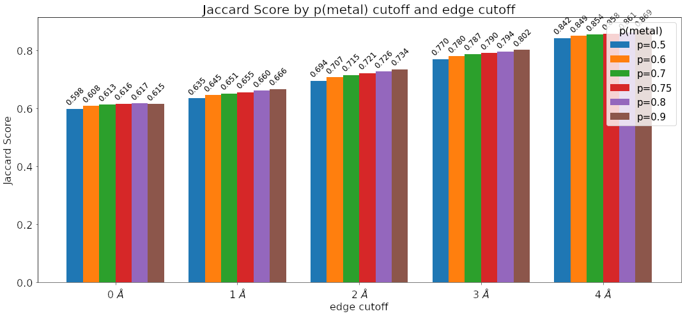
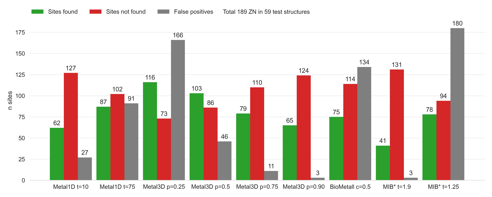

## Results

The dataset used for all training and analysis was obtained from the RCSB Protein Data Bank [@doi:REF]. We used the clustered PDB at 30% sequence identity to remove similar structures and used the highest resolution structure from each cluster that contained a zinc, did not contain DNA/RNA and had resolution < 2.5 Å. In case no structure was found the cluster was discarded for training of the models.. 

### Metal1D

The statistical analysis for the distance based model uses the `LINK` records present in deposited PDB structures. This training set structures are used to extract a probability map for the coordinating amino acids. In inference mode the map is used to predict metal sites: for a given protein structure, each amino acid of the protein is scored based on the probability map, performing a geometrical serch around the amino acid. For Zn(II), the average `LINK` distance was 2.2 ± 0.2 Å, and the default search radius was set to 5.5 Å. 

Once all amino acids in the chain are scored, site predictions are made grouping the highest-scored amino acids in clusters, based on distance <!--what is the cutoff-->. For each cluster, a site prediction is made as a weighted average between the coordinates of the reference point of each amino acid, using as weighting factor the amino acid score. A final re-scoring is performed, now assigning a score to the predicted locations for the sites, based on surrounding amino acids, in order to sort the predictions based on the probability. This reduces possible artefacts originating from sites which are placed in positions with a low-probable coordinating environment. 

The Metal1D predictor is available as self-contained notebook on Google Colab. 

### Metal3D

The training examples were sampled from the chosen structure by choosing a balanced number of boxes from each protein that contain or do not contain a zinc within 12 A of the central residue. Each box was randomly rotated such that the model is insensitive to rotation. Metal3D predicts a per residue probability density that can then be averaged over all residues or used individually (e.g for protein design). 

<!-- Hyperparameter tuning using Ray tune -->

We evaluated the of quality of predictions per box using the discretized Jaccard Score (similarity of two sets) on the testset. We noticed that at the edges often spurious density is predicted so we evaluated the similarity of the test set boxes and the prediced boxes removing the outer edge of the boxes.
[@fig:jaccard] shows that the similarity of the boxes does not depend much on the cutoff chosen with higher cutoff yielding slightly higher jaccard similarity values (0.02  - 0.04 difference between 0.5 and 0.9). Reducing the size of the analzyed boxes (i.e trimming of the edges) has a much more drastic influence on the jaccard score increasing the jaccard similarity from ⩰ 0.6 to ~ 0.86 showing that the metal density close to the central residue is much better predicted than at the box edges.

{#fig:jaccard}

Metal3D is available as self-contained notebook on GoogleColab:

#### Selectivity for other metals

{#fig:selectivity-metal3d}

Trained exclusively on zinc, Metal3D works well to predict the location of transition metals from 25 randomly drawn structures for each metal. 
[@fig:selectivity-metal3d] shows that recall is high for all transition metals meaning the Metal3D model correctly finds most sites in the test sets. For the alkali and earth alkali metals recall is much lower as the model only finds some sites. 
The mean probability for found zinc structures (ZN p= 0.95 ± 0.09) in the test set is higher than for the other transition metals [@fig:selectivity-probability-metal3d] and significantly higher than for the alkali metals (NA p=0.58 ± 0.07, K p=0.91 ± 0.07). The probability for MG (p=0.66 ± 0.09) is lower than for CA (p=0.74 ± 0.15). The RMSD for each found metal site is again lowest for zinc (1.05 ± 0.64 Å). The mean RMSD for the found sodium (n=2) and potassium (n=5) are as low as for the other transition metals. The only metal with significantly higher RMSD (2.01 ± 1.04 Å) is copper(I). 

For Metal1D overall recall is lower with similiar differences in the detection of main group metals versus transition metals [@fig:selectivity-metal1d; @fig:selectivity-distance-metal1d]

#### Alpha Fold 

AlphaFold often predicts sidechains in metal ion binding sites in the holo conformation. Services like AlphaFill use homology to transplant metals from similar PDB structures to the AlphaFold structure. Metal3D does not use homology can even deal with metal sites that are only partially in the holo conformation. 

{#fig:alphafold}

#### Hidden/transient metalsites

Metallodrugs are in important class of drugs that rely on binding inhibitors to a protein (or DNA). Metal3D can be used to screen the hidden metalloproteome by finding transient metal ion binding sites. 

The site where Rapta binds is detected with p=0.3 but in a high resolution structure without (1KX4) there is a salt bridge with a lysine that might occlude metal detection. One could weight by the rotamer/do MD simulation e.g similar as for cryptic pockets. 

{#fig:drugdesign}

#### HCA2: case study

HCA2 is the first enzyme where a catalytic zinc was discovered and is therefore one of the best studied metalloenzymes to date with a rich throve of mutational data available. 
On the wildtype enzyme crystal structure (2CBA) Metal3D perfectly recapitulates the location of the active site metal when using a high probability cutoff (p>0.4). The sites predicted with lower probability all look like reasonable transient binding sites at the surface of the protein. 

 <iframe src="interactive/index.html" title="2CBA probabilities" width="100%" height="900px" frameborder="0"></iframe> 

{#fig:2cba-probabilites}

We used in silico generated mutants matching mutants in the first and second shell of the active site zinc and probed the effect on the predicted metal probability. For mutants that decrease zinc binding also a drop in probability can be observed that correlates well with the experimentally measured $K_d$. We used a consistent set of $K_d$ values from the literature.

{#fig:hca-kd}

### Comparison of Metal1D, Metal3D, MIB and BioMetAll

Many metal ion predictors exists that can be subdivided in two categories: binding site predictors and binding location predictors. The former label only the residues binding the ion, the latter also predict a location of the ion. 

In addition to Metal1D and Metal3D we also compared two recent predictors BioMetAll and MIB. MIB uses a fragment method to identify homologus binding sites to the motifs it finds in a given structure and will extract the location of the metal from the homologous structures in its database. The main performance regulator of MIB is the tscore cutoff which is a parameter for the template similiarity with higher values requiring higher similiarity. 
BioMetAll was calibrated on the PDB and places probes on a regular grid at all sites where they find the criteria to be fulfilled. For each collection of probes also a center of the probes is given which we used to assess performance as there is no individual ranking of the probes given by the program. The main parameter for BioMetAll is the cluster cutoff which indicates how many probes in reference to the largest cluster a specific cluster has. We used a cutoff of 0.5 requiring all chosen clusters to have at least 50% of the probes of the most popolous. 

For both tools the recommended settings match the accuracy of Metal3D p=0.75 with a lot more false positives. 
Metal1D offers high detection capabilites but also with a high number of false positives.
While MIB also offers high precision, BioMetAll (using the cluster center) is not very precise with a MAD for correctly identified sites of 2.8 +- XX. Metal1D which identifies more sites than BioMetAll is slightly more precise than BioMetAll. MIB detects less sites but does so with high precision because it can use homologues sites to correctly place the metal ligand. BioMetAll also often provides probes that correctly identify the metal but as there is no ranking of the probes any probe could be closest to the actual location. 

{#fig:comparison}

{#fig:distances-testset-Metal3D}
