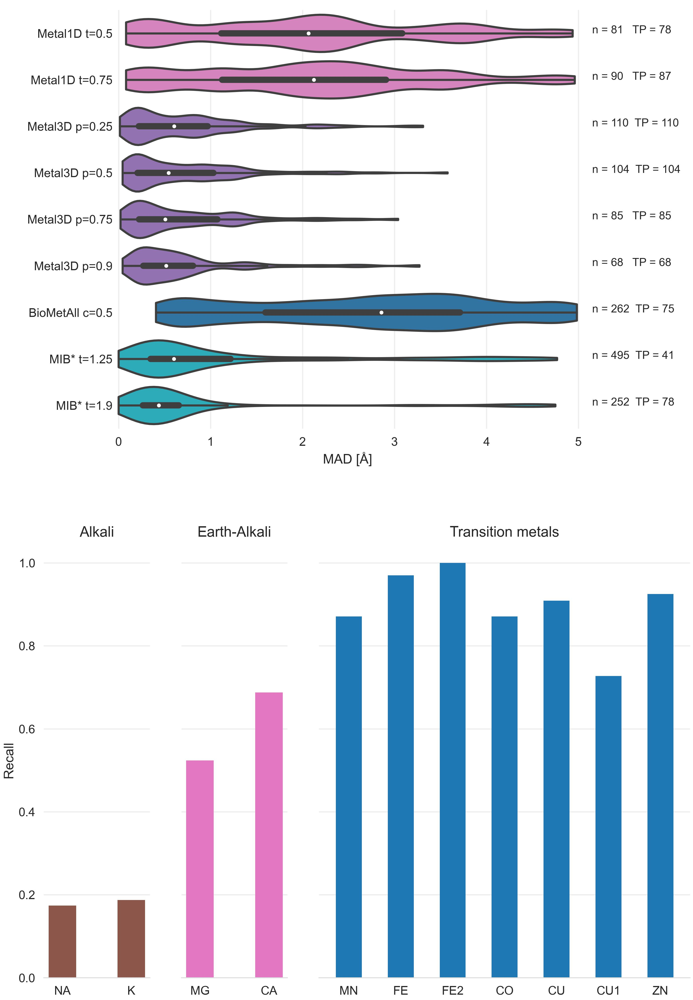
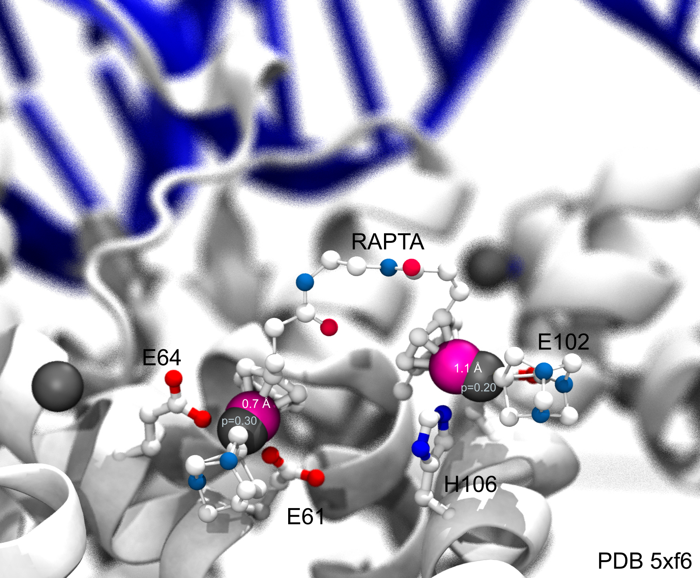
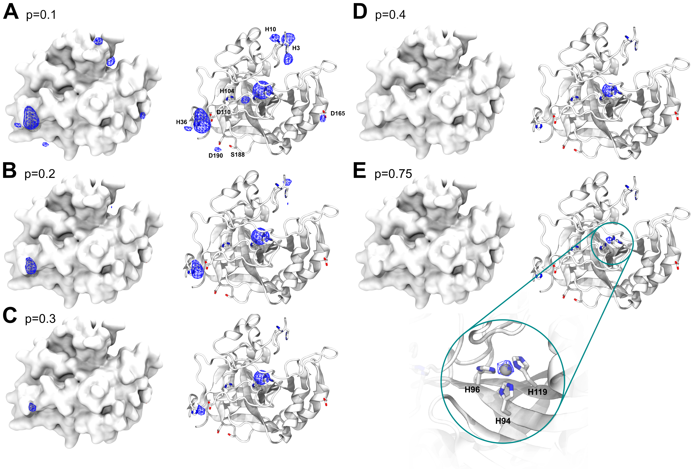

## Results

The dataset used for all training and analysis was obtained from the RCSB Protein Data Bank [@doi:10.1093/nar/28.1.235]. We used the clustered PDB at 30% sequence identity to remove similar structures and used the highest resolution structure from each cluster that contained a zinc, did not contain DNA/RNA and had resolution < 2.5 Å. In case no structure was found the cluster was discarded for the training of the models. 

### Metal1D
<!-- insert reference to the figure with the workflow in the methods? In case we can do the same for Metal3D-->
The statistical analysis for the distance based model uses the `LINK` records present in deposited PDB structures. These training set structures are used to extract a probability map for the coordinating amino acids. In inference mode the map is used to predict metal sites: for a given protein structure, each amino acid of the protein is scored based on the probability map, performing a geometrical search around the amino acid. For Zn(II), the average `LINK` distance was 2.2 ± 0.2 Å, and the default search radius was set to 5.5 Å. 

Once all amino acids in the chain are scored, site predictions are made grouping the highest-scored amino acids in clusters, based on distance (using twice the search radius as cutoff). For each cluster, a site prediction is made as a weighted average between the coordinates of the reference point of each amino acid, using as weighting factor the amino acid score. A final re-scoring is performed, now assigning a score to the predicted locations for the sites, based on surrounding amino acids, in order to sort the predictions based on the probability. This reduces possible artefacts originating from sites that are placed in positions with a low-probable coordinating environment. 

The Metal1D predictor is available as self-contained notebook on Google Colab. 

### Metal3D

The training examples were sampled from the chosen structure by choosing a balanced number of boxes from each protein that contain or do not contain a zinc within 12 A of the central residue. Each box was randomly rotated such that the model learns rotation invariant features. Metal3D predicts a per residue probability density that can then be averaged over all residues or used individually (e.g for protein design). 

<!-- Hyperparameter tuning using Ray tune -->

We evaluated the quality of predictions per box using the discretized Jaccard Score (similarity of two sets) on the testset. We noticed that at the edges often spurious density is predicted so we evaluated the similarity of the test set boxes and the predicted boxes removing the outer edge of the boxes.
[@fig:jaccard] shows that the similarity of the boxes does not depend much on the cutoff chosen with higher cutoff yielding slightly higher jaccard similarity values (0.02  - 0.04 difference between 0.5 and 0.9). Reducing the size of the analyzed boxes (i.e trimming of the edges) has a much more drastic influence on the jaccard score increasing the jaccard similarity from ⩰ 0.6 to ~ 0.86 showing that the metal density close to the central residue is much better predicted than at the box edges.

{#fig:jaccard}

Metal3D is available as self-contained notebook on GoogleColab:

### Selectivity for other metals
<!-- Explain recall in Methods -->

{#fig:selectivity-metal3d}

Trained exclusively on zinc, we checked how Metal3D performs to identify binding sites for sodium (NA), potassium(K), calcium (CA), magnesium (MG) and various transition metals (FE2, FE, CO, CU, CU1, MN, NI) from 25 unrelated structures per metal. 
[@fig:selectivity-metal3d] shows that recall is high for all transition metals meaning the Metal3D model correctly finds most sites in the test sets. For the alkali and earth alkali metals recall is much lower as the model only finds some sites. 
The mean probability for found zinc structures (ZN p= 0.95 ± 0.09) in the test set is higher than for the other transition metals [@fig:selectivity-probability-metal3d] and significantly higher than for the alkali metals (NA p=0.58 ± 0.07, K p=0.91 ± 0.07). The probability for MG (p=0.66 ± 0.09) is lower than for CA (p=0.74 ± 0.15). The RMSD for each found metal site is again lowest for zinc (1.05 ± 0.64 Å). The mean RMSD for the found sodium (n=2) and potassium (n=5) are as low as for the other transition metals. The only metal with significantly higher RMSD (2.01 ± 1.04 Å) is copper(I).  [@fig:selectivity-distance-metal3d]

The only two structures where a sodium is detected (2OKQ, 6KFN) both bind the sodium have at least 2 sidechain ligand atoms and only one backbone (2OKQ) or no backbone ligand atom. Canonical sodium binding sites e.g such as in PDB 4I0W <!-- add pdb doi? @doi:10.2210/pdb4I0W/pdb--> with two backbone carbonyl and one asparagine sidechain have probabilities around 5 %. 

For Metal1D overall recall is lower with similar differences in the detection of main group metals versus transition metals [@fig:selectivity-metal1d; @fig:selectivity-distance-metal1d]

### Comparison of Metal1D, Metal3D, MIB and BioMetAll

Many metal ion predictors exist that can be subdivided into two categories: binding site predictors and binding location predictors. The former label only the residues binding the ion, the latter also predict a location of the ion. 

In addition to Metal1D and Metal3D we also compared two recent predictors BioMetAll and MIB. MIB uses a fragment method to identify homologous binding sites to the motifs it finds in a given structure and will extract the location of the metal from the homologous structures in its database. The main performance regulator of MIB is the tscore cutoff which is a parameter for the template similarity with higher values requiring higher similarity. 
BioMetAll was calibrated on the PDB and places probes on a regular grid at all sites where they find the criteria to be fulfilled. For each collection of probes also a center of the probes is given which we used to assess performance as there is no individual ranking of the probes given by the program. The main parameter for BioMetAll is the cluster cutoff which indicates how many probes in reference to the largest cluster a specific cluster has. We used a cutoff of 0.5 requiring all chosen clusters to have at least 50% of the probes of the most populous. 

For both tools the recommended settings match the accuracy of Metal3D p=0.75 with a lot more false positives. 
Metal1D offers high detection capabilities but also with a high number of false positives.
While MIB also offers high precision, BioMetAll (using the cluster center) is not very precise with a MAD for correctly identified sites of 2.8 +- XX. Metal1D which identifies more sites than BioMetAll is slightly more precise than BioMetAll. MIB detects fewer sites but does so with high precision because it can use homologues sites to correctly place the metal ligand. BioMetAll also often provides probes that correctly identify the metal but as there is no ranking of the probes any probe could be closest to the actual location. 

<!-- Update the two figures using t=0.5 and t=0.75 for metal1D (same in supplementary)-->
{#fig:comparison}

{#fig:distances-testset-Metal3D}

### Applications

#### Alpha Fold 

AlphaFold often predicts sidechains in metal ion binding sites in the holo conformation. Services like AlphaFill[@doi:10.1101/2021.11.26.470110] use homology to transplant metals from similar PDB structures to the AlphaFold structure. Metal3D does not use explicit homology based on sequence alignment like AlphaFill does. It identifies both the structural and catalytic site for the example (PDB 3RZV) used in Ref[@doi:10.1101/2021.11.26.470110] even though one of the sites in the AlphaFold model is slightly disordered with one of the binding residues in the solvent facing conformation (D309).
The distance between placed metal for Metal3D <!-- 0.5A model--> are 0.22 Å and 0.37 Å, for AlphaFill it is 0.21 Å and 0.41 Å.

{#fig:alphafold}

<!-- #### Hidden/transient metalsites

Metallodrugs are in important class of drugs that rely on binding inhibitors to a protein (or DNA). Metal3D can be used to screen the hidden metalloproteome by finding transient metal ion binding sites. 

The site where Rapta binds is detected with p=0.3 but in a high resolution structure without (1KX4) there is a salt bridge with a lysine that might occlude metal detection. One could weight by the rotamer/do MD simulation e.g similar as for cryptic pockets. 

{#fig:drugdesign} -->

#### Protein engineering

HCA2 is the first enzyme where a catalytic zinc was discovered and is therefore one of the best studied metalloenzymes to date with a rich amount of mutational data available. 
On the wildtype enzyme crystal structure (PDB 2CBA) Metal3D recapitulates the location of the active site metal when using a high probability cutoff (p>0.4) with the RMSD to the true metal location at XX A. At lower probability cutoffs the probability map indicates further putative metal ion binding sites with interactions mediated by surface histidine or aspartate residues (e.g XXXXX ) [@fig:2cba-probabilities]. 

 <iframe src="interactive/index.html" title="2CBA probabilities" width="100%" height="900px" frameborder="0"></iframe> 

{#fig:2cba-probabilites}

To investigate the capabilities for protein engineering we used mutational data for first and second shell mutants of the active site residues in human carbonic anhydrase. The dataset comprises Kd values from a calorimetric assay. There are no crystal structures available for the mutants so we used the structure builder in the EVOLVE package to choose the most favorable rotamer for each single point mutation. The analysis was run for each single mutant and the resulting probability maps were analyzed. For the analysis we used the maximum predicted probability as a surrogate to estimate relative changes in Kd. For mutants that decrease zinc binding we observe a drop in probability. The mutant with the lowest probability (H94A) is also the mutant with the lowest Kd (pmax = 0.62) indicating that the site can still bind a zinc but with reduced affinity. Even conservative changes such as H96C or H119C reduces the predicted probability by about 10% and reduce the kcat from pM to nM. For second shell mutants the influence of the mutations is less drastic with only minor changes in the predicted probabilities on the order of a few percent.

{#fig:hca-kd}
