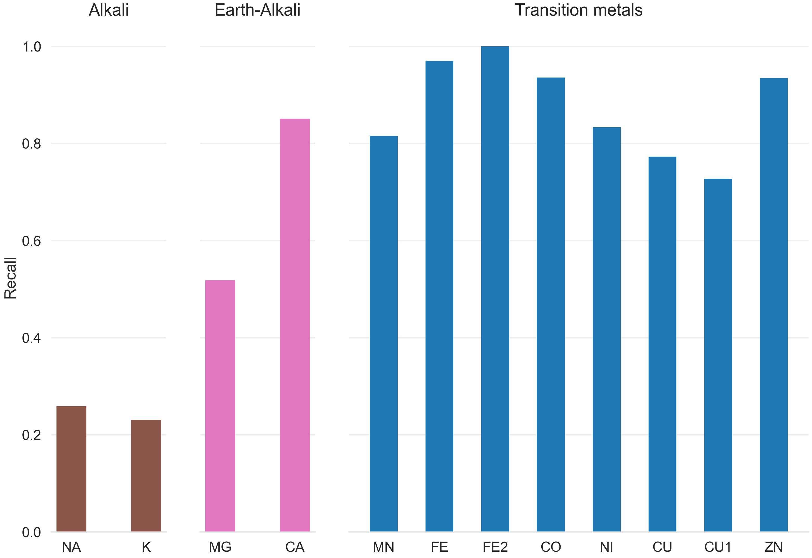
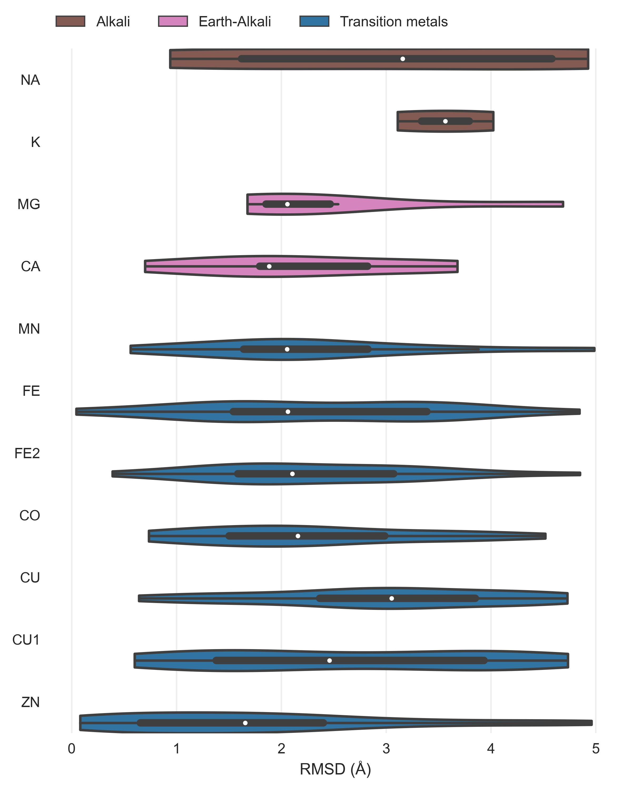
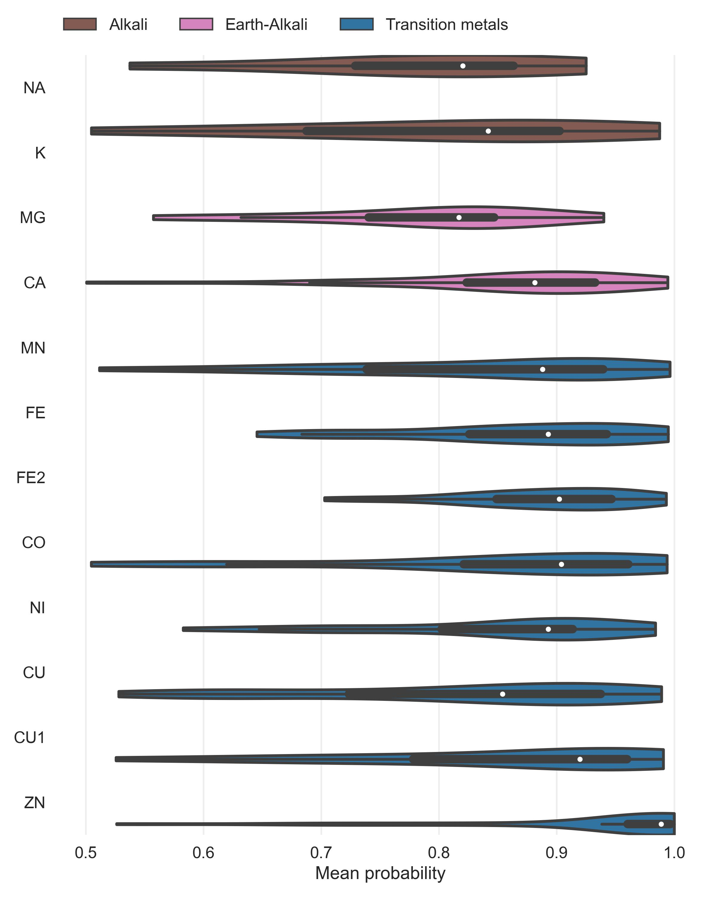
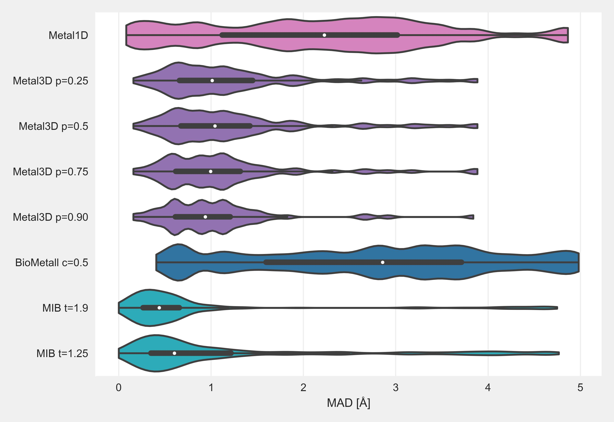

## Supplement

### Metal site detection using Metal1D

Maybe ROC curve for Metal1D and Metal3D here

### Metal selectivity Metal1D

{#fig:selectivity-metal3d}

{#fig:selectivity-distance-metal1d}

{#fig:selectivity-distance-metal3d}

{#fig:selectivity-probability-metal3d}

### Comparison 

{#fig:madonlyGoodZnmetal3d}

{#fig:tpfpfnonlyGoodZn}