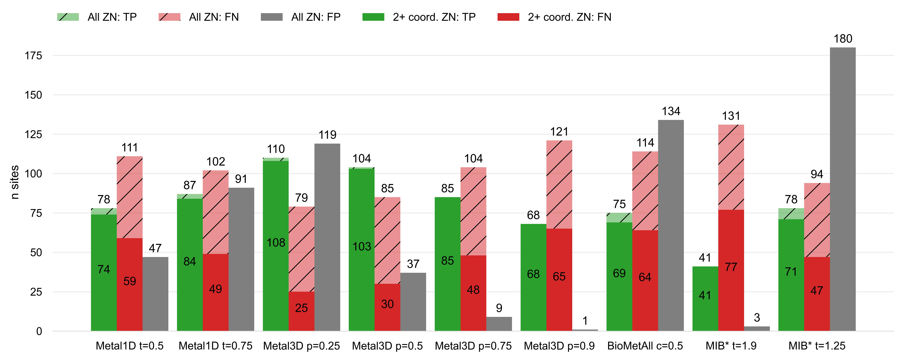
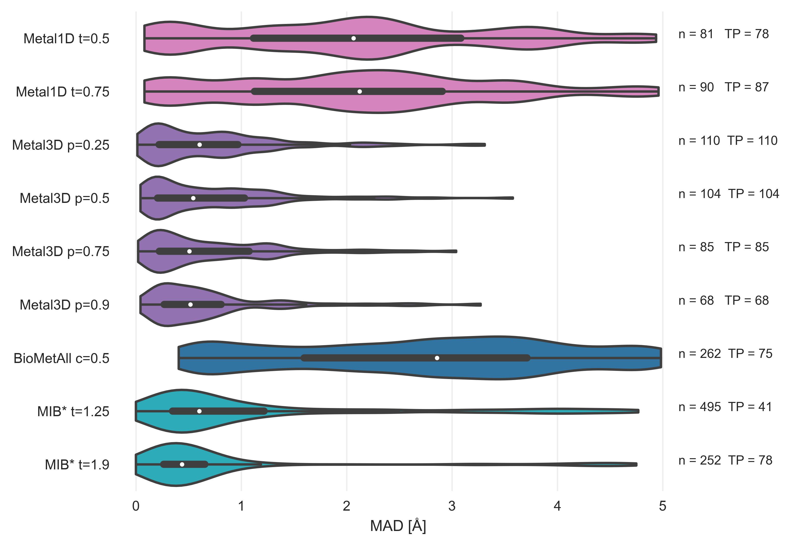

---
title: Accurate prediction of metalsites using deep learning
keywords:
- metal
- protein engineering
- deep learning
lang: en-US
date-meta: '2022-03-22'
author-meta:
- Simon L. Dürr
- Andrea Levy
- Ursula Rothlisberger
header-includes: |-
  <!--
  Manubot generated metadata rendered from header-includes-template.html.
  Suggest improvements at https://github.com/manubot/manubot/blob/main/manubot/process/header-includes-template.html
  -->
  <meta name="dc.format" content="text/html" />
  <meta name="dc.title" content="Accurate prediction of metalsites using deep learning" />
  <meta name="citation_title" content="Accurate prediction of metalsites using deep learning" />
  <meta property="og:title" content="Accurate prediction of metalsites using deep learning" />
  <meta property="twitter:title" content="Accurate prediction of metalsites using deep learning" />
  <meta name="dc.date" content="2022-03-22" />
  <meta name="citation_publication_date" content="2022-03-22" />
  <meta name="dc.language" content="en-US" />
  <meta name="citation_language" content="en-US" />
  <meta name="dc.relation.ispartof" content="Manubot" />
  <meta name="dc.publisher" content="Manubot" />
  <meta name="citation_journal_title" content="Manubot" />
  <meta name="citation_technical_report_institution" content="Manubot" />
  <meta name="citation_author" content="Simon L. Dürr" />
  <meta name="citation_author_institution" content="Laboratory of Computational Chemistry and Biochemistry, Institute of Chemical Sciences and Engineering, Swiss Federal Institute of Technology (EPFL) CH-1015 Lausanne, Switzerland" />
  <meta name="citation_author_orcid" content="0000-0002-4304-8106" />
  <meta name="twitter:creator" content="@simonduerr" />
  <meta name="citation_author" content="Andrea Levy" />
  <meta name="citation_author_institution" content="Laboratory of Computational Chemistry and Biochemistry, Institute of Chemical Sciences and Engineering, Swiss Federal Institute of Technology (EPFL) CH-1015 Lausanne, Switzerland" />
  <meta name="citation_author_orcid" content="0000-0003-1255-859X" />
  <meta name="citation_author" content="Ursula Rothlisberger" />
  <meta name="citation_author_institution" content="Laboratory of Computational Chemistry and Biochemistry, Institute of Chemical Sciences and Engineering, Swiss Federal Institute of Technology (EPFL) CH-1015 Lausanne, Switzerland" />
  <meta name="citation_author_orcid" content="0000-0002-1704-8591" />
  <meta property="og:type" content="article" />
  <meta property="twitter:card" content="summary_large_image" />
  <link rel="icon" type="image/png" sizes="192x192" href="https://manubot.org/favicon-192x192.png" />
  <link rel="mask-icon" href="https://manubot.org/safari-pinned-tab.svg" color="#ad1457" />
  <meta name="theme-color" content="#ad1457" />
  <!-- end Manubot generated metadata -->
bibliography: []
manubot-output-bibliography: output/references.json
manubot-output-citekeys: output/citations.tsv
manubot-requests-cache-path: ci/cache/requests-cache
manubot-clear-requests-cache: false
...

<!-- 
<small><em>
This manuscript
was automatically generated
on March 22, 2022.
</em></small> -->

## Authors

<!--  -->
<!-- 
+ **Simon L. Dürr**   
    {.inline_icon}
    [0000-0002-4304-8106](https://orcid.org/0000-0002-4304-8106)
    · {.inline_icon}
    [simonduerr](https://twitter.com/simonduerr) 
  <small>
     Laboratory of Computational Chemistry and Biochemistry, Institute of Chemical Sciences and Engineering, Swiss Federal Institute of Technology (EPFL) CH-1015 Lausanne, Switzerland
  </small>

+ **Andrea Levy**   
    {.inline_icon}
    [0000-0003-1255-859X](https://orcid.org/0000-0003-1255-859X) 
  <small>
     Laboratory of Computational Chemistry and Biochemistry, Institute of Chemical Sciences and Engineering, Swiss Federal Institute of Technology (EPFL) CH-1015 Lausanne, Switzerland
  </small>

+ **Ursula Rothlisberger** †  
    {.inline_icon}
    [0000-0002-1704-8591](https://orcid.org/0000-0002-1704-8591) 
  <small>
     Laboratory of Computational Chemistry and Biochemistry, Institute of Chemical Sciences and Engineering, Swiss Federal Institute of Technology (EPFL) CH-1015 Lausanne, Switzerland
  </small>
 -->

[{height="11px" width="11px"}](https://orcid.org/0000-0002-4304-8106)
Simon L. Dürr 1,
[{height="11px" width="11px"}](https://orcid.org/0000-0003-1255-859X)
Andrea Levy 1,
[{height="11px" width="11px"}](https://orcid.org/0000-0002-1704-8591)
Ursula Rothlisberger 1,†

<!--☯ --- These authors contributed equally.   -->
† --- To whom correspondence should be addressed: ursula.roethlisberger@epfl.ch
<small>

###### Affiliations

1. Laboratory of Computational Chemistry and Biochemistry, Institute of Chemical Sciences and Engineering, Swiss Federal Institute of Technology (EPFL) CH-1015 Lausanne, Switzerland

### Abstract

## Introduction

Metalloproteins are ubiqutious in nature and are present in all major enzyme familes. The metals typically found in biological systems are the first and second row alkali and earth alkali metals and the first row transition metals. The most common metal found in biologocial systems is Zinc (present in ~10% of deposited structures )<!-- ZN ligand in  18889 structures, 187844 total structures deposited in PDB. Considering all Zn-containing structures, the number is unchanged in practice (18923/187844=10%)-->In proteins, zinc is found as the redox inert Zn(2+) cation with electronic configuration [Ar]3d10. Zinc can fulfill both a  structural role (e.g in Zinc finger proteins) or a catalytic role in up to trinuclear active sites. Zn2+ is an excellent Lewis acid and is most often found in tetrahedral, pentavalent or octahedral coordination. In enzymes often a tetrahedral site is found that has an exogenous ligand (water, substrate) bound.

Metalloproteins are well studied because metall cofactors are essential for the function of many proteins. Many metalloproteins are also involved diseases [@doi:10.1038/s42256-019-0119-z]. Metalloproteins are also interesting for use in industrial applications because existing metal ion binding sites can be rapidly tuned using directed Evolution to catalyse a desired chemical reaction [@doi:10.1126/science.aau3744, @doi:10.1021/bi201881p, @doi:10.1039/C5SC01065A] utilizing the catalytic properties of the metal for the catalysis and the shape and polarity of the binding pocket for substrate/enantiomer selectivity. To crystalyze proteins, metals are also often added to the crystallization buffer as they can help in the formation of protein crystals overcoming the enthalpic cost of association of protein surfaces.  Metal ion binding sites can also be used to rapdily engineer protein-protein interactions (PPI) and the hypothesis has been put forward that one orgin of macromolecular complexity is the superfacial binding of metal ions in early single domain proteins. Many metal ion binding sites are still found at interfaces. 

While simple metal ion binding sites can be rapidly engineered because intial coordination on a protein surface can for example be achieved by creating an i, i+4 di-histidine site [@doi:10.1002/anie.202009226] or by placing thiol residues in spatial proximity [@doi:10.1038/nchem.1201] the engineering of complex metal ion binding sites is considerably more difficult [@doi:10.1093/protein/gzw026] as such sites are often supported by a network of hydrogen bonds. A complication for computational design of metalloproteins is the unavailability of good non-bonded force fields for transition metals that accurately reproduce the coordination number and coordination distances which renders design e.g using Rosetta very difficult [@doi:10.1093/protein/gzw026]. To treat metal sites in proteins adequately quantum mechanical treatment such as in hybrid quantum mechanics/molecular mechanics simulations [@doi:10.1021/cr500628b] is needed whose computational cost is prohibitive for regular protein design tasks. QM/MM simulations can however be used to verify coordination chemistry for select candidate proteins [@doi:10.1021/jacs.7b10660]. 

Many tools exists to predict whether a protein contains metals (ZincFinder [@doi:10.1186/1471-2105-8-39]), which residues in the protein bind a metal (IonCom [@doi:10.1093/bioinformatics/btw396], MIB) and where the metal is bound (AlphaFill [@doi:], FindsiteMetal [@doi:10.1002/prot.22913],BioMetAll [@doi:10.1021/acs.jcim.0c00827] ). The input for these predictors is based on sequence and/or structure. Sequence-based predictors are mostly based on scanning the sequence of a target protein to identify the regions where amino acid patterns match a metal-binding site fingerprint. 
On the other hand, structure-based methods are based on the geometrical 3D structure, either using homology to known structures (MIB, Findsite-metal, AlphaFill) or distance features (BioMetAll) to infer the location of metals. Some tools like Findsite-metal employ machine learning based approaches but currently there is no tool to use deep learning to predict metal location. 
Modern deep learning approaches have the advantage that they do not rely on careful feature extraction/engineering to extract relevant features. Structure based deep learning based approaches have been used in the field of protein research for a variety of applications such as protein structure prediction [@doi:10.1038/s41586-021-03819-2, @doi:10.1126/science.abj8754], prediction of identity of masked residues [@doi:10.1186/s12859-017-1702-0; @doi:10.1021/acssynbio.0c00345; @doi:10.1038/s41467-022-28313-9 ]), functional site prediction [@doi:10.1093/bioinformatics/bty813], for ranking of docking poses [@doi:10.1038/s41467-021-27396-0; @doi:10.1038/s41592-019-0666-6], prediction of the location of complex organic ligands [@doi:10.1093/bioinformatics/btx350; @doi:10.1093/bioinformatics/bty583; @doi:10.48550/arXiv.2202.05146 ; @doi:10.1038/s41592-019-0666-6] and prediction of effects of mutations for stability and disease [@doi:10.1038/s42256-019-0119-z, @doi:10.1371/journal.pcbi.1008291]. Most of those models represent the protein as voxels und apply 3D convolutional neural networks (CNN). Other architectures that treat the protein as surfaces or graphs often only use coarse grained (AlphaFold IPA) or no explicit sidechain information (EquiDock). 

Current state of the art predictors for metal-binding sites are MIB [@doi:10.1371/journal.pone.0039252;@doi:10.1021/acs.jcim.6b00407], which combines structural and sequence information in the "Fragment Transformation Method" to search for homologus sites in its database, and BioMetAll [@doi:10.1021/acs.jcim.0c00827], a geometrical predictor based on backbone preorganization. Both methods have significant drawbacks: MIB excluded metal sites with less than 2 coordination partners from its analysis and is limited by the availability of templates in the protein databank. BioMetAll does not use templates but provides many possible locations for metals in the vicinity of the binding site but does not rank the binding sites. <!--  The reported accuracy and sensitivity for the MIB predictor are 94.6% and 64.7%, respectively (average values on different metal ions, for Zn2+ in particular the corresponding values are 94.8% and	71.1%). For the BioMetAll predictor, the same quantities are not available, but a benchmark on 53 two-histidine one-carboxylate motifs resulted in an average distance between the predicted and the experimental site of the metal of (0.56±0.19)Å Put cluster center instead of one of the probe. These values refer to the performances assessed in the original publications, but are not straightforward to compare and extend to the general case. For this reason, in this work we also performed a robust and fair comparison of our two novel methods with MIB and BioMetAll predictors. -->
In this work, we present two metal ion location predictors that do not suffer from these drawbacks. The deep learning based Metal3D predictor operates on a voxelixed representation of a protein environment and predicts a metal probability density over the whole protein. The distance based predictor Metal1D predicts the location of metals using distances mined from the protein databank predicting single sites. 
These tools pave the way to perform in silico design of metal ion binding sites without relying on predefined geometrical rules or expensive quantum mechanical calculations. 

<!-- 

many biological functions [Percora review]? 
As oneof the most prevalent transition metal cofactors in
biological systems, it plays structural, signaling, and regulatory
roles and is found in all six classes of enzymes (most commonly
hydrolases

Understanding where metals bind in biology is related to health [@doi:10.1038/s42256-019-0119-z], biocatalyis [Kuhlman, Hilvert] and PPIs [Tezcan]. 

Starting with pioneering studies in the 1990 s,[@doi:10.1126/science.8346440;@doi:10.1146/annurev.biochem.68.1.779]there have been notable successes inthe de novo design of functional metalloproteins, which arepredominantly based on four-helix bundle anda-helicalcoiled-coiled motifs with readily parametrizable structure [@doi:10.1002/anie.202009226]. 

Zinc exists as a redox-inert Zn(II) cation with an electron configuration of [Ar]3d10
These properties with the lack of ligand field effects make zinc an excellent metal for different coordination numbers and binding geometries in different biological systems.
 Zinc can be found as an active site metal (cofactor) in all six IUBMB enzyme classes
### Deep learning on proteins
Torng/Shroff 3DCNN bio stuff 
Ananad DeepRank
Correia surface studies Nat Methods 

### Enzymes

### Interfaces
It has been hypothesized that some modern metalloproteins may have emerged through the metal-nucleated oligomerization of small peptides or protein domains, followed by the evolution of the resulting assemblies into stable, functional architecture.

Metal-Templated Interface Redesign (MeTIR) ). These strategies, inspired by both the proposed evolutionary roles of metals and their prevalence in natural PPIs, take advantage of the favorable properties of metal coordination (bonding strength, directionality, and reversibility) to guide protein self-assembly with minimal design and engineering

In order to circumvent the complexity of constructing extensive noncovalent interfaces, which are typically involved in natural PPIs

### Existing approaches

Computational predictors of metal-binding sites built on sequence analyses are mostly based on scanning the sequence of a target protein to identify those regions where amino acid patterns match a metal-binding site fingerprint. For zinc binding sites often two histidine spaced by one residue which allows to readily detect the motif are easy to detect. These predictors yield the identites of the coordinating residues. 

Structural detectors often used distance features to identify sites based on statistical mining in the protein databank.  Predictors trained like this can identify highly preorganized motifs (e.g 4x Cys in close spatial proximity) but are often not very good at identifying weakly preorganized motifs. Current state of the art predictors (MIB, BioMetAll) use fragments/homology to predict the location of the metal or backbone preorganization predicting an approximate position of the metal that is less sensitive to the exact side chain geometry thus affording higher sensitivity to detect metal sites(BioMetAll). MIB [@doi:10.1021/acs.jcim.6b00407] uses the fragmentation transformation method to search for homologus sites in its database

In our work we develop two new predictors primarily intended for zinc binding sites - Metal1D and Metal3D that are more accurate and sensitive than existing approaches in predicting metal ion binding sites. We evaluate their capability with respect to  -->

## Materials and Methods

### Dataset
The input PDB files for training were obtained from the RCSB [@doi:10.1093/nar/28.1.235] protein databank (Download 5th March 2021). We used a clustering at 30% sequence identity using mmseqs2 [@doi:10.1038/nbt.3988] as the input to largely remove sequence and structural redunancy in the input dataset. 
For each cluster we check whether a zinc is contained in one of the structures, whether the resolution of these structures is better than 2.5 Å, the experimental method is X-Ray crystallography and whether the structure does not contain nucleic acids. If there are multiple structures fulfilling the criteria the highest resolution structure is used. Structures that fulfill all criteria except the zinc criterion are kept for the selectivity analysis for different metals. 
All structures larger than 3000 residues are discarded. We always use the first biological assembly as metals are often located at protein interfaces. All structures are filtered to only contain zinc and protein residues. If there are multiple models in the structure the first one is used. 
The train/val/test split was performed based on sequence identity using `easy-search` in mmseqs2. All proteins that had no (partial) sequence overlap with any other protein in the dataset were put into the test/val set (85 proteins) which we further split into a test set of 59 structures and 36 structures in the validation set. The test set contained 1614 structures. (Reported as CSV Supplemental Data 1).

For the selectivity analysis the clusters from the PDB were randomly sampled to extract about 25 structures per metal (Supplemental Data 2) and all metal sites that had at minimum 3 unique protein ligands within 2.8 Å of the metal were used for the analysis to exclude any crystallization artefacts for the selectivity analyis. For the zinc analysis we used either all zinc ions contained in the structures or all that had at minimum 2 unique protein ligands within 2.8 Å of the metal. 

### Metal 1D

{#fig:metal1dworkflow}

The statistical analysis performed is focuses on the `LINK` records present in deposited PDB structures. In particular, this section of a PDB file specifies the connectivity between zinc (or any other metal ion) and the amino acids of the protein, and each `LINK` record specifies one `LINK`age. The idea of basing this approach on the `LINK`s is an extension to the approach by Barber-Zucker *et al.* [@doi:10.1038/s41598-017-16777-5], where they used the `LINK` records to investigate the propensity of transition metals to bind different amino acids, but not for the coordination.

In Metal1D, after the statistical filtering a probability map is generated from the `LINK` records, extracting for each zinc ion the coordination experimentally observed. In this phase, `LINK` records involving only a single amino acid are excluded since they probably correspond to weak binding sites. In this phase, also `LINK` records containing water molecules are excluded. This is done for two main reasons: a reliable probability map including waters would only include high-resolution structures, drastically reducing the pool of experimental structures used. Moreover, even using a probability map including water, in the predicting phase water molecules would need to be present in the investigated structure. However, this poses additional problem, because the quality of modeled water molecules in crystal structures varies [@pmid:3736419]<!-- paper from 1986, we can also look for something more recent -->, other experimental or computational methods such as alpha fold do not provide water models, and it is difficult to add water molecules a posteriori [@doi:10.1016/j.csbj.2020.02.001]<!-- this is more a review on available softwares for waters, not sure this is what you had in mind-->. Even if many tools are available, Dowser++ [@doi:10.1002/prot.25081] and WaterDock2 [@doi:10.1371/journal.pone.0172743] among the most diffused and powerful ones, they are not able to handle the presence of metal ions. Due to these limitations, water molecules are considered only implicitly in this method.

The learned probability map is used to predict the metal sites for a given protein structure. To make a prediction, each amino acid of the protein is scored. The 3D protein structure is analyzed using the BioPandas python library [@doi:10.21105/joss.00279]. The score is assigned performing a geometrical search from a reference point, defined as the coordinate of the most probable metal binding atom, within a search radius, considered as twice the typical distance between the metal ion and the binding atom of amino acids in proteins. This quantity is enlarged of an arbitrary factor, in order to be able to take into account deviations from the ideal cooridnation and give more flexibility to the search. In case of amino acids which present more than one atom which typically binds metals, such as Histidine, the mid-point is used and the search radius is enlarged accordingly. 
The score is assigned to each amino acid considering all the other reference points of other amino acids within the search radius, and summing the probabilities in the probability map for coordinations compatible with the one observed. In the ideal case, a score of 1 would correspond to an amino acid surrounded by all possible coordinating amino acids observed in the probability map. In practice, scores result between 0 and less than 1.

Once all amino acids in the chain are scored, site predictions are made grouping the highest-scored amino acids in clusters, based on distance. In practice, highest-scored amino acids are the ones with a score within a given threshold of the highest-scored one. For each cluster, a site prediction is made as a weighted average between the coordinates of the reference point of each amino acid, using as weighting factor the amino acid score. In the case of clusters composed of only one amino acid, to be able to place the metal, a fictitious score equal to the single highest-scored amino acid in the cluster is assigned to the nearby amino acid  (within the search radius) with the highest score. <!-- Did you try using some kind of bond vector ? I imagine this approach will have difficulty differntiating Ne Nd in histidines-->
 It is important to note that the fictitious score is assigned to be able to predict a site as a weighted average, for which two points are needed, also for clusters composed of only one high-scored amino acid. However, the potential artefacts introduced by assigning a fictitious score to another amino acid is resolved by a final re-scoring of all the predicted sites.
This final re-scoring also mitigates the errors which can be introduced by calculating the site simply as a weighted average. In particular, a final geometrical search is performed around each predicted site (within 60% of the search radius, which as explained is about twice the typical metal-amino acid distance) and a score is now assigned to the site. This score is assigned in the same way as the amino acid scores, based on the probability map, and has the advantage of being able to sort the predicted metal sites based on their probability, according to the method. In this last re-scoring, sites with a probability lower than a certain threshold with respect to the highest-scored one, are excluded, in order to focus only on predictions with the highest probability. 

### Metal 3D

#### Voxelization
We used the moleculekit python library [@doi:10.1021/acs.jctc.6b00049; @doi:10.1093/bioinformatics/bty583] to voxelize the input structures into 3D grids. 8 different input channels are used: aromatic, hydrophobic, positive ionizable, negative ionizable, hbond donor, hbond acceptor, occupancy and metal ion binding site chain were used. The scores are assigned using AutoDockVina atom names and a boolean mask. For each atom matching one of the categories a smooth gaussian distribution centered on the atom with sigma the vdW radius of the atom is used to assign the voxel value. For the target box only zinc ions were used. The target tensor was discretized setting any voxel above 0.05 to 1 (true location of zinc), all other to 0 (no zinc).  We used a box size of 20 Å centered on the CA residue of a residue, rotating each box randomly. The voxel grid used a 1 Å resolution. Any alternative conformations modeled were discarded keeping only the highest occupancy. 
For all structures selected for the respective sets we partioned the residues of the protein into residues within 12 Å of a zinc ion and ones not within 12 Å of a zinc. A single zinc site will therefore be present many times in the dataset but each time translated to the  To make a balanced set of examples we voxelize all residues that are close to a zinc and an equal amount of residues randomly drawn from the non-zinc binding residues. 
The environments are precomputed and stored in HDF5 files for concurrent access during training. In total 266283 environements were computed for the training set, XXX for the test set, XXX for the validation set. 

#### Model training
We used PyTorch 1.10 to train the model. All layers of the network are convolutional layers with filter size 3 Å except for the second layer where 4 Å size is used and the fifth layer where a 16 Å filter is used to capture long range interactions. We use zero padding to keep the size of the boxes constant. Models were trained on a workstation with 2x NVIDIA GTX2070 GPU and 28 CPU cores. 
Binary Cross Entropy [@doi:10.1007/s10479-005-5724-z] loss is used to train the model. The rectified linear unit (ReLU) non-linearity  is used except for the last layer which uses a sigmoid function which yields the probability for zinc per voxel.
A dropout layer (p = 0.2) was used between the 5th and 6th layer. 
The network was trained using AdaDelta, a stepped learning rate (lr=1.0, ɣ=0.7) a batch size of 500 and 12 epochs to train.

#### Hyperparameter tuning
Ray Tune following parameters were tuned with 15 different combinations:

- filtersize: 3,4
- dropout : 0.1, 0.2, 0.4, 0.5
- learning rate : 0.5, 1.0, 2.0
- gamma: 0.5, 0.7, 0.8, 0.9
- batch size: 128, 200, 500

#### Grid Averaging <!-- I changed it to a subsubsub section (####), before it was just # but I think it was not meant -->

Predictions for a complete protein are obtained by voxelizing select residues of the protein (default all cysteines, histidines, aspartates, glutamates) and averaging the boxes using a global grid. The global grid is obtained by computing the bounding box of all points. In between the bounding box a regular grid at 1 A intervals is computed. Using the KD-Tree implementation in scipy for each grid point all close points within 1 A are taken and the voxel value is set as the mean probability from all points. The output is saved as cube file. 

[@2cbastructurepaper]:  doi:10.1016/0022-2836(92)90531-N

#### HCA2 mutants 
The HCA2 mutants were extracted from Ref [@doi:10.1021/bi00255a003; @doi:10.1021/ja00079a046;@doi:10.1021/bi00089a005; @doi:10.1073/pnas.92.11.5017; @doi:10.1021/bi9526692] and the crystal structure 2CBA [@2cbastructurepaper; @doi:10.2210/pdb2CBA/pdb] was used. The zinc was modeled using the zinc cationic dummy model forcefield [@pmid:11106157] and we verified that energy minization produced the correct coordination environment. The Richardson rotamer library [@pmid:10861930] was used with the EVOLVE-ddG energy function to compute the most stable rotamer for a given mutation. The lowest-energy mutant was used for the prediction of the location of metals.

#### Evaluation 

To evaluate the trained model we monitored how accurately the model predicts the metal density of the test set. We used a discretized version of the jaccard index setting each voxel either as 0 (no metal) or  1 (zinc present). We tested multiple different decision boundaries 0.5, 0.6, 0.75, 0.9 and also comparing a slightly smaller centered box to remove any spurious density at the box edges where the model only has incomplete information to make predictions.

The Jaccard index is computed as 
$$
J=\frac{\#\left|V_{p} \cap V_{exp}\right|}{\#\left|V_{p} \cup V_{exp}\right|},
$$
where $Vp$ is the array of voxels with predicted probability above the decision boundary and $V_{exp}$ is the array of voxels with the true metal locations also discretized at the same probability threshold.

In order to standardize the evaluation between different tools, we always used the same testset using held out samples for the training of Metal3D and Metal1D. In order to compute standard metrics such as precision and recall we chose to assess performance by comparing the predictions using a standardized radius around the true metal sites. Any prediction within 5 A of a true metal site is counted as true positive. Multiple predictions by the same tool for the same site are counted as 1 true positive. Any site that has no predicted metal within 5 A is counted as false negative. A false positive prediction is a prediction that is not within 5 A of a zinc site and also not within 5 A of any other false positive prediction. If two or more false positive predictions are within 5 A they are counted as a single false positive prediction. These metrics are mainly useful for analysis on how good the models are at discovering sites and how much these predictions can be trusted. In order to assess the quality of the predictions we additionally compute the for all the true positive predictions the mean of the euclidean distance between the true and predicted site (mean absolute deviation). For MIB, Metal1D and BioMetAll MAD was computed for all predictions above the threshold within 5 A of a true zinc. This was made as some tools predict the same site for different residue combinations and we wanted to assess the general performance for all predicted sites above a certain cutoff and not just for the best predicted site for the cutoff. For Metal3D the center of mass of all voxels above the cutoff was used with each voxel weighted by the probability value. 

## Results

The dataset used for all training and analysis was obtained from the RCSB Protein Data Bank [@doi:10.1093/nar/28.1.235]. We used the clustered PDB at 30% sequence identity to remove similar structures and used the highest resolution structure from each cluster that contained a zinc, did not contain DNA/RNA and had resolution < 2.5 Å. In case no structure was found the cluster was discarded for training of the models. 

### Metal1D
<!-- insert reference to the figure with the workflow in the methods? In case we can do the same for Metal3D-->
The statistical analysis for the distance based model uses the `LINK` records present in deposited PDB structures. This training set structures are used to extract a probability map for the coordinating amino acids. In inference mode the map is used to predict metal sites: for a given protein structure, each amino acid of the protein is scored based on the probability map, performing a geometrical serch around the amino acid. For Zn(II), the average `LINK` distance was 2.2 ± 0.2 Å, and the default search radius was set to 5.5 Å. 

Once all amino acids in the chain are scored, site predictions are made grouping the highest-scored amino acids in clusters, based on distance (using twice the search radius as cutoff). For each cluster, a site prediction is made as a weighted average between the coordinates of the reference point of each amino acid, using as weighting factor the amino acid score. A final re-scoring is performed, now assigning a score to the predicted locations for the sites, based on surrounding amino acids, in order to sort the predictions based on the probability. This reduces possible artefacts originating from sites which are placed in positions with a low-probable coordinating environment. 

The Metal1D predictor is available as self-contained notebook on Google Colab. 

### Metal3D

The training examples were sampled from the chosen structure by choosing a balanced number of boxes from each protein that contain or do not contain a zinc within 12 A of the central residue. Each box was randomly rotated such that the model learns rotation invariant features. Metal3D predicts a per residue probability density that can then be averaged over all residues or used individually (e.g for protein design). 

<!-- Hyperparameter tuning using Ray tune -->

We evaluated the quality of predictions per box using the discretized Jaccard Score (similarity of two sets) on the testset. We noticed that at the edges often spurious density is predicted so we evaluated the similarity of the test set boxes and the prediced boxes removing the outer edge of the boxes.
[@fig:jaccard] shows that the similarity of the boxes does not depend much on the cutoff chosen with higher cutoff yielding slightly higher jaccard similarity values (0.02  - 0.04 difference between 0.5 and 0.9). Reducing the size of the analzyed boxes (i.e trimming of the edges) has a much more drastic influence on the jaccard score increasing the jaccard similarity from ⩰ 0.6 to ~ 0.86 showing that the metal density close to the central residue is much better predicted than at the box edges.

{#fig:jaccard}

Metal3D is available as self-contained notebook on GoogleColab:

### Selectivity for other metals
<!-- Explain recall in Methods -->

{#fig:selectivity-metal3d}

Trained exclusively on zinc, we checked how Metal3D performs to identify binding sites for sodium (NA), potassium(K), calcium (CA), magnesium (MG) and various transition metals (FE2, FE, CO, CU, CU1, MN, NI) from 25 unrelated structures per metal. 
[@fig:selectivity-metal3d] shows that recall is high for all transition metals meaning the Metal3D model correctly finds most sites in the test sets. For the alkali and earth alkali metals recall is much lower as the model only finds some sites. 
The mean probability for found zinc structures (ZN p= 0.95 ± 0.09) in the test set is higher than for the other transition metals [@fig:selectivity-probability-metal3d] and significantly higher than for the alkali metals (NA p=0.58 ± 0.07, K p=0.91 ± 0.07). The probability for MG (p=0.66 ± 0.09) is lower than for CA (p=0.74 ± 0.15). The RMSD for each found metal site is again lowest for zinc (1.05 ± 0.64 Å). The mean RMSD for the found sodium (n=2) and potassium (n=5) are as low as for the other transition metals. The only metal with significantly higher RMSD (2.01 ± 1.04 Å) is copper(I).  [@fig:selectivity-distance-metal3d]

The only two structures where a sodium is detected (2OKQ, 6KFN) both bind the sodium have at least 2 sidechain ligand atoms and only one backbone (2OKQ) or no backbone ligand atom. Canonical sodium binding sites e.g such as in PDB 4I0W <!-- add pdb doi? @doi:10.2210/pdb4I0W/pdb--> with two backbone carbonyl and one asparagine sidechain have probabilities around 5 %. 

For Metal1D overall recall is lower with similiar differences in the detection of main group metals versus transition metals [@fig:selectivity-metal1d; @fig:selectivity-distance-metal1d]

### Comparison of Metal1D, Metal3D, MIB and BioMetAll

Many metal ion predictors exist that can be subdivided in two categories: binding site predictors and binding location predictors. The former label only the residues binding the ion, the latter also predict a location of the ion. 

In addition to Metal1D and Metal3D we also compared two recent predictors BioMetAll and MIB. MIB uses a fragment method to identify homologus binding sites to the motifs it finds in a given structure and will extract the location of the metal from the homologous structures in its database. The main performance regulator of MIB is the tscore cutoff which is a parameter for the template similiarity with higher values requiring higher similiarity. 
BioMetAll was calibrated on the PDB and places probes on a regular grid at all sites where they find the criteria to be fulfilled. For each collection of probes also a center of the probes is given which we used to assess performance as there is no individual ranking of the probes given by the program. The main parameter for BioMetAll is the cluster cutoff which indicates how many probes in reference to the largest cluster a specific cluster has. We used a cutoff of 0.5 requiring all chosen clusters to have at least 50% of the probes of the most popolous. 

For both tools the recommended settings match the accuracy of Metal3D p=0.75 with a lot more false positives. 
Metal1D offers high detection capabilites but also with a high number of false positives.
While MIB also offers high precision, BioMetAll (using the cluster center) is not very precise with a MAD for correctly identified sites of 2.8 +- XX. Metal1D which identifies more sites than BioMetAll is slightly more precise than BioMetAll. MIB detects less sites but does so with high precision because it can use homologues sites to correctly place the metal ligand. BioMetAll also often provides probes that correctly identify the metal but as there is no ranking of the probes any probe could be closest to the actual location. 

<!-- Update the two figures using t=0.5 and t=0.75 for metal1D (same in supplementary)-->
{#fig:comparison}

{#fig:distances-testset-Metal3D}

### Applications

#### Alpha Fold 

AlphaFold often predicts sidechains in metal ion binding sites in the holo conformation. Services like AlphaFill[@doi:10.1101/2021.11.26.470110] use homology to transplant metals from similar PDB structures to the AlphaFold structure. Metal3D does not use explicit homology based on sequence alignment like AlphaFill does. It identifies both the structural and catalytic site for the example (PDB 3RZV) used in Ref[@doi:10.1101/2021.11.26.470110] even though one of the sites in the AlphaFold model is slightly disordered with one of the binding residues in the solvent facing conformation (D309).
The distance between placed metal for Metal3D <!-- 0.5A model--> are 0.22 Å and 0.37 Å, for AlphaFill it is 0.21 Å and 0.41 Å.

{#fig:alphafold}

<!-- #### Hidden/transient metalsites

Metallodrugs are in important class of drugs that rely on binding inhibitors to a protein (or DNA). Metal3D can be used to screen the hidden metalloproteome by finding transient metal ion binding sites. 

The site where Rapta binds is detected with p=0.3 but in a high resolution structure without (1KX4) there is a salt bridge with a lysine that might occlude metal detection. One could weight by the rotamer/do MD simulation e.g similar as for cryptic pockets. 

{#fig:drugdesign} -->

#### Protein engineering

HCA2 is the first enzyme where a catalytic zinc was discovered and is therefore one of the best studied metalloenzymes to date with a rich amount of mutational data available. 
On the wildtype enzyme crystal structure (PDB 2CBA) Metal3D recapitulates the location of the active site metal when using a high probability cutoff (p>0.4) with the RMSD to the true metal location at XX A. At lower probability cutoffs the probability map indicates further putative metal ion binding sites with interactions mediated by surface histidine or aspartate residues (e.g XXXXX ) [@fig:2cba-probabilities]. 

 <iframe src="interactive/index.html" title="2CBA probabilities" width="100%" height="900px" frameborder="0"></iframe> 

{#fig:2cba-probabilites}

To investigate the capabilities for protein engineering we used mutational data for first and second shell mutants of the active site residues in human carbonic anhydrase. The dataset comprises Kd values from a calorimetric assay. There are no crystal structures available for the mutants so we used the structure builder in the EVOLVE package to choose the most favorable rotamer for each single point mutation. The analysis was run for each single mutant and the resulting probability maps were analyzed. For the analysis we used the maxium predicted probability as a surrogate to estimate relative changes in Kd. For mutants that decrease zinc binding we observe a drop in probability. The mutant with the lowest probability (H94A) is also the mutant with the lowest Kd (pmax = 0.62) indicating that the site can still bind a zinc but with reduced affinity. Even conservative changessuch as H96C or H119C reduces the predicted probability by about 10% and reduce the kcat from pM to nM. For second shell mutants the influence of the mutations is less drastic with only minor changes in the predicted probabilites on the order of few percent.

{#fig:hca-kd}

## Discussion

Metal3D predicts the probability distribution of zinc in protein crystal structures based on a model trained on natural protein environments. The model is trained similar to image segmentation and is trained on binary output i.e if a voxel contains metal or not. By limiting the training samples to high resolution crystal structures (2.5 A) we achieve good results with limited noise after grid averaging. The use of high resolution structures is necessary because at resolution greater than the average zinc coordination distance (2.2A) the distance deviations of the coordination partners with the metal noticeably increases [@doi:10.1021/ic401072d]. 
In contrast to the currently available tools we did not filter the training examples for certain coordination requirements (i.e only sites with at least 3 protein ligands). This allows the model to also predict sites with partial coordination. This is necessary for protein design software to carry out iterative residue sampling starting from a non-metal binding protein and design first a nucleus binding site and then fullfil the remaining coordination requirements. Methods such as MIB which rely on homology therefore perform worse on such weak binding sites because reducing the quality of the available templates by including 1- or 2-coordinate sites would yield many false positives (similar to including less homologous structures for the template search).  Metal3D also explicitly knows about the environment in the vicinity of a putative site and therefore can use the local context to better triage actual metal ion binding sites from other interactions. 
The majority of sites in the training set are well coordinated sites and during training the model can relate the frequency of different metalion binding motifs in the training set with the probability of metal presence. The fraction of artifactutal zinc binding site in the protein data bank is estimated to be about 1/3[@doi:10.1021/ic401072d] with the zinc ions aiding crystal formation. As we train on biological assemblies some of those binding sites might be located at the surface of the assembly whereas in the assymetric unit of the crystal they might form part of a crystal contact. For the model these half-sites can be seen as data augmentation strategy with noisy incomplete sites. 

Empty coordination sites of metals are filled with water molecules in case there is no other exogenous ligand with higher affinity present (e.g a thiol). Our models do not consider water molecules in the input as the quality of water molecules in the protein databank is not very consistent and in protein design algorithms explicit water molecules are usually implcitily modeled. Common water placement algorithms to place deep waters are either computationally expensive or do not consider the location for metal ions (Dowser++ [@doi:10.1002/prot.25081]). For Metal3D the model inputs for the total density however encode an implicit water function where all empty space can be interpreted as the solvent. <!--For Metal1D sites with water ligands were excluded in the training which might explain part of its worse performance with respect to Metal3D. -->

This work is the first to report a modern deep learning based model destined for metal-protein docking. In the more general space of protein-ligand docking a variety of architectures and representations have been used. 3D CNN based approaches such as LigVoxel and DeepSite commonly use a resolution of 1 Å and similar input features as our model to predict the ligand density. However, predicting the density of a multi-nuclear ligand is more complex than predicting the density of mononuclear metal ions. We therefore did not deem it necessary to include a conditioning on how many metal ions are present in the box and rather chose to reflect this in the training data where the model needs to learn that only about half of the environments it sees contain one or more metals. This choice is validating by the fact that outputed probability densities at sufficiently high probability cutoff are sphereical with their radius approximately matching the VDW radius of Zinc.  Mesh convolutional neural networks trained on  protein surface representation [@doi:10.1038/s41592-019-0666-6] also have been used to predict the location and identity of protein ligands but this approach can only label the regions of the surface that bind the metal ion and the algorithm would need to be modifed to give the exact location of the metal. Some metal ion binding sites are also heavily buried inside proteins as they mediate structural stability rendering them inaccessible to a surface based approach. The most recent approaches such as EquiDock use equivariant neural networks such as En-Transformer [@doi:10.48550/arXiv.2102.09844] to predict binding keypoints (defined as 1/2 distance between the C$_{alpha}$ of the binding residue and a ligand atom). Explicit sidechains are still too expensive for such models. In addition the current state of the art architecture achieves a mean RMSD for the ligand of <2 Å only for 25% of their testset. Our model in contrast has a a mean RMSD of <1 Å over the whole testset which remains almost constant no matter the chosen probability cutoff. The lack of accuracy of the equivariant approaches renders them unsuitable for design of complex metal ion binding sites supported by an intricate network of hydrogen bonds that need to be positioned with sub-angstrom accuracy. Our model in contrast is computationally more expensive and less dataefficient due to the need to voxelize the input and provide different rotations of the input environment. 
In contrast to sequence based models [@doi:10.1101/2021.12.22.473759;@doi:10.1038/s41598-018-34533-1] our model is more data efficient and better suited to be integrated into structure based design workflows such as Rosetta or EVOLVE. Sequence based approaches can only use coevolution signals to infer residues in spatial proximity that can bind a metal. This is easy for sites that contain a HxH motif such as found in HCA2 but might be considerably more difficult when it comes to ranking different sites (e.g histidine versus cysteine) where subangstrom level precision is needed to identify the mutant with the highest affinity for zinc.

Protein design using 3D convolutional neural nets trained on residue identity has been successfully demonstrated and we anticipate that our model could be seamlessly integrated into such as workflow [@doi:10.1038/s41467-022-28313-9] to enable fully deep learning based design of metalloproteins. We are currently investigating integration of Metal3D combined with a classic energy based genetic algorithm based optimization. Standard machine learning models such as Random Forest have been used for classyifing metal sites as enzymatic or non-enzymatic using features computed using Rosetta and from the identity of the amino acids. Adapting our model to predict the metal and its coordination partners would allow to do a similar assessment assuming that most enzymatic metal active sites (with iron-suflur clusters as notable exception). Using standard machine learning models a prediction of the location of the metal would be much harder.  

In terms of selectivity both of our models have a clear preference for transition metals over main group metals. The only sites identified for sodium in the test set are the ones that have sidechain ligands. Many sodium and potassium sites are using backbone carbonyl coordination exclusively which is not common for zinc and those sites are therefore not detected. It has recently been demonstrated how a transition metal can be selectively bound to a protein (Choi, Tezcan, Nature 2022). This however was only achieved using non-ideal coordination which is better tolerated by some transition metals due to the different electronic configurations. It is likely impossible to train a predictor that can perfectly discriminate zinc from e.g copper and nickel sites because the coordination environments and coordination distances within the given resolution threshold are basically indistinguishable. The availability of metals inside the organism is heavily compartimentalized, therefore an approach using solely the structure will be unable to capture the full selectivity. In addition, sometimes non-native metals are used for crystallization experiments because the reaction catalyzed by an active site metal might exhibit different kinetics with different metals. The metal in the deposited structure might therefore not be the native metal. In fact, we observe that our model sometimes predicts zinc where there is a calcium modeled in the structure (EXAMPLE PDB) potentially showing another usecase for the model -> Model validation.

The HCA2 application demonstrates the utility of Metal3D for protein engineering. The kinetics of metal ion binding to proteins are complicated [@doi:10.1021/ic301645j] and there are currently no highthroughput based approaches that could generate a dataset large enough to train a model directly on predicting Kd. The data we use was obtained from a colorimetric assay predicting very high affinity of zinc[@doi:10.1021/bi00255a003;@doi:10.1021/ja00079a046;@doi:10.1021/bi00089a005;@doi:10.1073/pnas.92.11.5017;@doi:10.1021/bi9526692]. More recent studies using ITC [@doi:10.1021/ic301645j] instead of the colorimetric assay indicate lower  Kd values. In this work we chose to use the old data for consistency to estimate how well the model can recapitulate the changes in the  Kd for different mutations in the first and second shell of a prototypical metalloprotein. 

Metal1D is inferior to Metal3D for the prediction of general metal ion binding sites because it produces more false positives while at the same time detecting less metal sites. This demonstrates the inherent limitation of using solely distance based features for prediction of metal location. BioMetAll which is the tool most similar to Metal1D also suffers from many false positive predictions. A possible application the authors propose is mining the protein databank for candidate metalloproteins that with relatively few mutations can be equipped with a metal ion binding site. Metal3D can be used in a similar fashion by performing rotamer sampling (e.g using a genetic algorithm) scoring each rotamer combination for its metal ion binding propensity. 

Metal3D is the first tool with angstrom level precision to predict the location of metal ion binding sites suitable for optimization of proteins. Different applications are possible: 1) Protein-Function annotation using structures predicted using Alpha Fold. 2) Integration in protein design software that performs rotamer optimization to improve the predicted metal probability near a specific point or somewhere in the protein. This could be used for engineering novel metalloproteins or metal mediated PPIs  3) Similar to detection of cryptic binding pockets one could search for cryptic metal ion binding sites in common drug targets  to  crosslink multiple faint metalbinding sites to get an inhibitive effect. 

Many of these applications allow to explore the still vastly untapped potential of proteins as large programmable multidentate metal ligands with tunable surfaces. In particular it might be easier to design protein binders using metal mediated interactions as the metal binding can overcome the entropic cost of association of two protein surfaces. Zinc is generally available in the intracellular volume and extracellurly with the total concentration of zinc in cells estimated at about 200 μM. The real available concentration of free zinc is picomolar[@doi:10.1021/cr800556u] wherefore it is crucial that design tool produces well designed sites. 

Metal3D allows to move away from using rational approaches such as the  i, i + 4 diHis motifs used for the assembly and stabilization of metalloproteins and peptides through coordination of divalent transition metal ions to a fully automated approach. [@doi:10.1126/science.8346440; @doi:10.1126/science.1648261; @doi:10.1038/nsb723]

<!-- 
Choice of resolution cutoff
Zinc The average bond length corresponds to a resolution of ∼2.2 Å. Also, the deviation increases noticeably after the resolution exceeds 2.5 Å. [@doi:10.1021/ic401072d]

Why were nucleic structures excluded? Why include all zinc sites and not just the good ones?

model choice? Why are CNNs better than equivariant approaches for this kind of work?. Recent work EquiDock uses no sidechains at all, gets ligand RMSD where only 25% are under a 2 threshold, https://arxiv.org/pdf/2202.05146.pdf Mean RMSD 8.3 A, Centroid 42.4

MIB discards all sites with less than 2 coordination partners so it will not be able to identify labile binding sites. 

Discuss 4L99 which is one of the FN for the model. Here are Lysine next to the zinc and therefore probability is low.Could be wrongly modeled (carboxlyated lysine instead of normal lysine) [@doi:10.1016/S0022-2836(02)00422-9] but some leucyl aminopeptidases also have this coordination. (check 10.1515/BC.2006.191 to find mechanism)

discuss why water molecules were not considered. considered only implicitly. Might be integrated in future but needs quality check for existing waters in training/test set 
Methods [References Dowser] that place deep waters but they do not know about metals. 

Lack in selectivity could be related to smoothing the gaussian quite a bit when training (anything >0.05) is a hit. 
Resolution of grid might be an issue 
Might be improved by improving the grid resolution to 0.5  

Discuss selectivity. E.g based on [@doi:10.1073/pnas.0906852107]. Zinc prefers tetrahedral coordination, whereas e.g copper(II) (and maybe CU(I)- check it) prefers square planar which might explain a bit lower selctivity. In the work by Tezcan the protein assemblies form different complexes with the different metals. 

General implications for the faint metal ion binding sites detected using the model: This is evident from the fact that unstructured polypeptides and folded proteins alike often form aggregates in the presence of high concentrations of transition metals.
Once the entropic cost of association is overcome, the resulting noncovalent interfaces can be optimized through additional mutations
 These nonspecific interactions could explain why free zinc concentration is tightly controlled in cellular environments; the total concentration of zinc in cells is about 200 μM, but the concentration of free zinc is only picomolar[@doi:10.1021/cr800556u].

From a practical inorganic chemical viewpoint individual proteins can be utilized as large polydentate ligands that bring along the advantage of having extensive functionalizable surfaces. From a functional perspective metals possess properties such as Lewis acidity and redox reactivity that enable them to carry out catalytic transformations not accessible by organic building blocks.

Our tool allows to move away from using rational approaches such as the  i, i + 4 diHis motifs used for the assembly and stabilization of metalloproteins and peptides through coordination of divalent transition metal ions to a more knowledgebased approach. [@doi:10.1126/science.8346440; @doi:10.1126/science.1648261; @doi:10.1038/nsb723]

Moreover, one-third of the zinc ions present in crystal structures are artifacts, merely aiding crystal formation and packing with no biological significance [@doi:10.1021/ic401072d]

 The small size of the Zn(II) cation (∼74 pm for four-coordinate and ∼88 pm for six-coordinate ion) prevents higher coordination numbers due to molecular repulsion and higher energy orbitals

Discussion with DeepSite which uses a sliding box approach and does not give individual residue scores. Therefore less useful for protein design. -->

 <!-- KD values discussion (new ITC data vs. old data by Kiefer, Fierke etc): 
 
 Old method: Enzyme-
bound zinc (E—Zn) was quantitated using the colorimetric
4-(2-pyridylazo)resorcinol (PAR) method of Hunt et al.
(1984) and measuring the absorbance at 500 nm. 4-(2-Pyridylazo)resorcinol (PAR) is a dibasic acid that forms the protonated complexes with most metal ions. It serves as a metallochromic indicator and is suitable as a chromogenic agent for the quantitative determination of over 50 elements.

removing unbound zinc by chromatography on a
PD-10 column, and measuring the protein concentration and
bound zinc concentration in the eluant using the PAR assay
(Hunt et al., 1984).
The concentration of free zinc in the
dialysis buffer was calculated from the Tris—zinc stability
constants (Dawson et al., 1986). The dissociation constant
was calculated using KaleidaGraph program with eq:
[E-ZN]/[E]tot = C/(1+Kd/[Zn]free)

Newer method: [@doi:10.1021/ic301645j]
 -->

## Conclusion

## Supplement

### Precision/Recall

{#fig:precisionrecall}

### Metal selectivity 

#### Metal1D

{#fig:selectivity-metal1d}

{#fig:selectivity-distance-metal1d}

#### Metal3D

{#fig:selectivity-distance-metal3d}

{#fig:selectivity-probability-metal3d}

### Comparison 

{#fig:madonlyGoodZnmetal3d}

All zincs

| tool            |   ('mad', 'mean') |   ('mad', 'std') |   ('mad', 'median') |
|:----------------|------------------:|-----------------:|--------------------:|
| BioMetAll c=0.5 |          2.71684  |         1.33464  |            2.85877  |
| MIB t=1.25      |          1.13143  |         1.24625  |            0.602234 |
| MIB t=1.9       |          0.771154 |         1.09266  |            0.438837 |
| Metal1D t=0.5   |          2.06879  |         1.33191  |            2.0658   |
| Metal1D t=0.75  |          2.1184   |         1.26664  |            2.12326  |
| Metal3D p=0.25  |          0.738592 |         0.656188 |            0.605668 |
| Metal3D p=0.5   |          0.728648 |         0.6605   |            0.543843 |
| Metal3D p=0.75  |          0.710761 |         0.635722 |            0.508051 |
| Metal3D p=0.9   |          0.698812 |         0.639415 |            0.517282 |

2+ coordinated zincs

| tool            |   (MAD mean           | median |
|:----------------|----------------------:|-------:|
| BioMetAll c=0.5 |          2.68 ± 1.33  |  2.84  |
| MIB t=1.25      |          1.09 ± 1.21  |  0.60  |
| MIB t=1.9       |          0.77 ± 1.09  |  0.44  |
| Metal1D t=0.5   |          1.97 ± 1.29  |  1.99  |
| Metal1D t=0.75  |          2.06 ± 1.24  |  2.09  |
| Metal3D p=0.25  |          0.69 ± 0.58  |  0.56  |
| Metal3D p=0.5   |          0.69 ± 0.59  |  0.54  |
| Metal3D p=0.75  |          0.71 ± 0.64  |  0.51  |
| Metal3D p=0.9   |          0.70 ± 0.64  |  0.52  |

## References {.page_break_before}

<!-- Explicitly insert bibliography here -->

